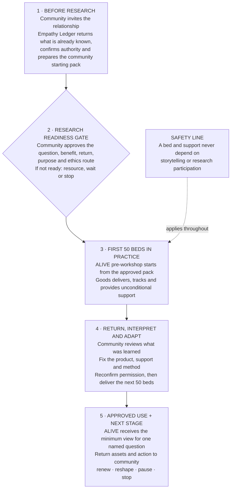

# ALIVE × Goods on Country × Empathy Ledger

## 100 beds, community-owned pre-alignment and the first 12 months

*Partner-facing working model, 30 August 2026. Prepared from the Victoria conversation, the Miro working board, the existing ALIVE Notion record and the universal Goods tracking model.*

> **The conclusion:** Empathy Ledger creates the community-owned starting point before ALIVE begins research engagement. Goods on Country then uses the 100 paid beds to keep a practical relationship alive through delivery, support and return. ALIVE joins through a community-approved research gate and receives only the exact evidence approved for a named question and use.

The 100 beds are not a sample and they do not purchase stories. They are a practical commitment that lets the partnership show up more than once, fix what needs fixing and build enough trust for a deeper conversation if a community wants it.

---

## 1. What was actually resolved

### Clear from the conversation

- **Work should begin “from the ground”.** Community knowledge and relationships are the starting point. The partnership should not arrive with a literature-built frame and ask community to validate it.
- **The first step is pre-alignment, not research collection.** Before ALIVE workshops, the partnership needs to understand what is already known, what people have already said, who holds authority and what a useful next conversation could be.
- **Empathy Ledger can act as the community’s clearinghouse.** It holds story assets, prior work, permissions and community interpretation so people can retrieve and reuse what they have already made instead of starting at step one for every new researcher, funder or visitor.
- **ALIVE can use an approved pre-workshop pack.** The pack helps ALIVE arrive informed and shape an initial engagement from community knowledge. It does not give ALIVE blanket access to raw stories or decide the research question in advance.
- **The relationship needs repeated touchpoints.** A meaningful conversation may emerge on a second or third visit. Checking whether a bed works, repairing it and returning what was heard are legitimate reasons to show up. Research must remain optional.
- **The “make” in “What makes a bed?” matters.** The inquiry can hold the physical bed, what makes it safe and useful, what makes a home, who makes and repairs it, and what a bed may make possible.
- **Research has a distinct job.** ALIVE must protect research quality, ethics, analysis and translation. Community and storyteller authority still sit alongside institutional ethics rather than being replaced by it.
- **Partner readiness controls timing.** A partner such as Children’s Ground may need a longer governance process and may not be ready for an October activity. Beds can still be delivered elsewhere without forcing a research timetable onto a relationship.

### Commercial facts already on record

- The 100-bed Goods commitment is recorded under **INV-0342**: 100 Stretch Beds plus four shared bed-building/community engagement visits, **$92,000 excluding GST**. The user has confirmed the beds are locked and paid.
- The separate Empathy Ledger lane is recorded under **INV-0341**: 12 months at $5,000 per month, **$60,000 excluding GST / $66,000 including GST**, described as platform access, account management and storytelling support.
- Goods and Empathy Ledger remain separate work orders, budgets and acceptance paths even when a trip supports both.
- The Notion workspace confirms that INV-0341 was issued. **Its PO, contracting and payment status are not confirmed in the available record.**

### Proposed here, not yet agreed

- Run the 100 beds as **two learning batches of 50**, with a formal community return and adaptation gate between them.
- Use a three-touchpoint minimum rhythm: pre-delivery relationship and authority; delivery/early support; return/support and interpretation. Each community can choose another rhythm.
- Use the sharper shared invitation: **“What makes a bed, here, and what can a bed make possible?”** The wording is a conversation door, not an interview script.
- Treat the $60,000 Empathy Ledger scope as one complete pre-alignment-to-approved-use demonstration across the 12 months, not as unlimited multi-community fieldwork.

---

## 2. The model in one sentence

> **Community knowledge sets the starting point; Empathy Ledger stewards it; Goods makes and supports the practical commitment; ALIVE uses only approved evidence to build research and action; value and learning return to community.**

### The shift from the earlier diagram

The previous diagram put the 100 beds and the research question too close to the start. This version inserts two necessary steps:

1. **Community-owned pre-alignment before ALIVE engagement.**
2. **A research readiness gate before ALIVE receives a research view.**

That changes Empathy Ledger from an optional story repository after delivery into the infrastructure that prepares the relationship before research and continues to protect story ownership through the whole year.

### The safety line

Receiving, keeping, repairing or replacing a bed never depends on telling a story, joining a workshop or participating in research. Storyteller permission, community authority and ALIVE ethics remain separate approvals.

---

## 3. What Empathy Ledger pre-alignment does

**Pre-alignment** means building a community-approved starting point before a research team asks new questions. It is not desk research about a community and it is not an AI-generated summary of people’s lives.

For each selected community or partner setting, Empathy Ledger supports five steps:

1. **Find and return what already exists.** Bring together the community’s relevant stories, videos, meeting artefacts, prior projects and Goods relationship history. Return copies and usable files to the people authorised to hold them.
2. **Name the authority around each thing.** Distinguish personal storyteller rights, community or cultural authority, organisational stewardship and possible research use. Unknown authority stays unknown rather than being treated as permission.
3. **Identify what should not be asked again.** Record priorities, repeated questions, known sensitivities, preferred language, previous commitments and gaps that community wants to address.
4. **Prepare a community starting pack.** Community decides which items and summaries can orient ALIVE before a workshop. The pack is a bounded view with purpose, audience, expiry and return conditions.
5. **Prepare the next invitation.** Name who invites, who should be present, what benefit is offered, what is not being requested, what ALIVE hopes to learn and how people can say no or stop.

### The pre-workshop pack

The pack should be short enough to use. For each community it contains:

- why the relationship exists and who invited it;
- the community’s existing priorities and preferred language;
- approved story or artefact summaries, with links only where use is authorised;
- what Goods has already done, promised and learned in that place;
- authority and governance routes;
- what people have already been asked and what should not be repeated;
- practical bed, support, making and repair context;
- questions or tensions the community wants ALIVE to understand;
- the exact purpose of the coming workshop and what comes back afterward.

ALIVE uses this to prepare. It cannot publish it, analyse it for another grant or reuse it in another project without a separate approved use.

---

## 4. The shared inquiry

# What makes a bed, here, and what can a bed make possible?

This is broad enough to connect the grants and practical enough to keep the work grounded. It should stay open to the possibility that a community reframes or rejects it.

Five conversation doors can support the first workshop:

1. **What is a bed here now?** Current products, sleeping arrangements, home, family use, mobility and what works or does not.
2. **What makes it a good bed?** Safety, heat, airflow, cleaning, durability, repair, comfort, culture, visitors and kinship.
3. **Who makes and cares for it?** Allocation, delivery, assembly, local support, repairs, paid work, skills and responsibility.
4. **What can it make possible?** Rest, dignity, a functioning home, safer everyday conditions, less waste, work, learning, local decisions or something the partnership has not anticipated.
5. **Who decides what the learning means?** Community interpretation, storyteller permission, research use, action, return and what should happen next.

These are not fixed outcome categories. They are prompts that community can change. Health, mental health, climate and economic outcomes become research questions only after the community starting point and ALIVE’s ethics pathway are agreed.

---

## 5. The 12-month plan

### Year-1 outcome

By August 2027, the partnership has delivered and supported 100 beds, completed one governed community-story-to-research pathway, returned useful assets and learning, and made an evidence-based decision about the next stage of the five-year relationship.

| Timing | Phase | Work | Concrete outputs | Gate |
|---|---|---|---|---|
| **September 2026** | Contract and choose | Attach this scope to INV-0341; confirm PO, signatories, payment path, EL project steward and separate field/community budgets. Shortlist relationship-ready settings without promising a site. | Signed work order; commercial schedule; readiness shortlist; named owners | No EL delivery starts without an accepted work order and payment route |
| **October–November 2026** | Pre-align from the ground | Community invitation; relationship and authority mapping; inventory and return existing stories/artefacts; document what not to ask again; confirm local support and community return. | Authority map; source/artefact register; community starting pack v1; risk and readiness record | Community/program authority agrees the pack is useful and safe to continue |
| **December 2026–January 2027** | Community-led framing | ALIVE receives only the approved starting pack. Run a pre-workshop and initial engagement led from the community starting point. Shape the Year-1 question, exact evidence use, ethics route and benefit. | Community-framed question; engagement protocol; participant explanation; return plan; research-use proposal | Research readiness gate: purpose, benefit, authority, ethics owner and stop conditions are clear |
| **February–April 2027** | Batch 1: 50 beds | Manufacture/allocate, QA, deliver and register the first controlled batch. Offer unconditional early support. Create optional story pathways only through the agreed invitation. | 50 Bed Passports; delivery and support records; issues and repairs; optional governed stories; first ALIVE approved view if ready | Support works without story participation; community review occurs before scaling |
| **May 2027** | Return and adapt | Return story assets and practical learning. Community, Goods, EL and ALIVE review what worked, what caused burden and what needs changing. Test narrowing, withdrawal and export. | Community return; product/support changes; method changes; withdrawal/export test; Batch 2 decision | Community can continue, reshape, defer or stop the evidence pathway independently of remaining bed delivery |
| **June–July 2027** | Batch 2: 50 beds | Deliver the second controlled batch using the changed product, allocation, support and engagement method. Continue flexible support and one bounded governed-use pathway. | 50 more Bed Passports; revised support evidence; approved purpose-limited ALIVE view; traceable action/non-action | 100 beds accounted for and every research use remains exact, current and revocable |
| **August 2027** | Year-1 return and next-stage decision | Community interpretation, ALIVE synthesis, Goods operational review and EL governance review. Return materials and decide renewal. | Year-1 learning pack; community-held export; actual-cost review; five-year charter and Year-2 work order or clean close | Renew, reshape, pause or stop. Nothing continues by inertia |

### Three relationship touchpoints

The plan needs repeat contact, but not a fixed survey burden.

- **Before delivery:** establish invitation, authority, what is already known, bed need, local support and what a useful return would be.
- **Delivery and early support:** make sure the bed is safe, complete and usable. Fix practical issues first. An optional story invitation is separate and never the reason for the visit.
- **Return and continued support:** check repairs and continued usefulness, return assets and interpretation, ask what should change and agree whether another research use is wanted.

A third visit may be where a deeper conversation becomes possible. That is a relationship outcome, not a collection target.

---

## 6. The paid Empathy Ledger work order

### Work order title

**Community Pre-Alignment and Governed Evidence Demonstration**

### Commercial starting point

- **Existing instrument:** INV-0341
- **Term:** 12 months from agreed commencement
- **Fee:** $60,000 excluding GST / $66,000 including GST
- **Contracting route:** confirm ALIVE/University entity, ACT/Empathy Ledger entity, authorised signatories, PO requirements and invoice due date
- **Relationship to Goods:** separate from the paid 100-bed Goods work order and its four workshop/engagement visits

The quickest path to payment is not to create a new broad proposal. It is to attach a precise scope and acceptance schedule to the existing $60,000 instrument, confirm the University PO/payment route and have Victoria sponsor the internal approval.

### Purpose

Establish and test one community-owned pre-alignment and governed evidence pathway that lets ALIVE begin from approved community knowledge, undertake a community-led pre-workshop, receive one exact research view and return value without taking ownership of stories or making research a condition of Goods support.

### Included deliverables

1. **Partnership and authority foundation**
   - one governance and research-alignment workshop;
   - named project steward and decision-rights map;
   - one readiness assessment for the selected pilot setting;
   - one agreed purpose, benefit, return and stop/exit record.
2. **Community pre-alignment**
   - one bounded inventory of existing relevant stories, artefacts and prior work;
   - authority, permission and provenance map;
   - return of authorised copies/assets;
   - one community-approved pre-workshop starting pack.
3. **Empathy Ledger environment and support**
   - configured project/portfolio, roles and access;
   - consent, authority, use, expiry, withdrawal, return and export records;
   - standard hosting, account management and named-user orientation;
   - a safe reference to Goods evidence without copying recipient or operational records.
4. **One governed pathway**
   - community invitation and one bounded story/knowledge activity;
   - supported community interpretation;
   - one exact ALIVE use proposal and approved view;
   - one participant/community return;
   - narrowing, withdrawal and export rehearsal.
5. **Learning and next-stage package**
   - midpoint adaptation review;
   - final learning and actual-effort review;
   - recommendation and scope for Year 2: renew, expand, reshape, pause or exit.

### Acceptance criteria

- Community or program authority approves the starting pack and engagement purpose.
- Storytellers and rightsholders can see, narrow and withdraw their permissions.
- ALIVE can prepare for the workshop without raw or blanket access to community material.
- Goods support works when no one tells a story or joins research.
- One approved evidence view reaches one named ALIVE recipient for one named purpose.
- Community receives the agreed assets or value back and can export what it is authorised to hold.
- Action and non-action following the evidence are recorded without claiming that one bed or story caused a system outcome.

### Explicit exclusions

The $60,000 does not include manufacture or delivery of beds; unrestricted multi-community fieldwork; extensive travel; unlimited recording, transcription, translation or media production; Elder, storyteller or local steward payments beyond an expressly agreed allowance; ALIVE ethics administration or academic analysis; major custom software; public publishing rights; AI training; or ownership of community stories.

### Dependencies that need a separate budget or owner

- community, Elder, local steward and storyteller time;
- travel, accommodation, freight and on-ground logistics;
- the four Goods workshop/engagement visits already included in INV-0342;
- ALIVE research, ethics, analysis and institutional data-management work;
- additional communities, outputs or grant-specific views beyond the one demonstration.

### Payment and commencement checklist

- [ ] Victoria confirms this scope reflects the discussion.
- [ ] ALIVE names the internal budget, contracting entity, PO owner and authorised approver.
- [ ] ACT confirms the contracting entity, GST treatment, bank details and insurance/privacy documents.
- [ ] Parties confirm whether INV-0341 is payable as issued or needs a University work order/PO attached first.
- [ ] Commencement date and 12-month end date are written into the instrument.
- [ ] Community and field costs are shown as separate envelopes rather than silently absorbed by the EL fee.
- [ ] A 60-minute commercial close meeting is held with only the people needed to approve scope, PO and payment.

---

## 7. Roles and boundaries

| Partner | Leads | Does not receive or decide automatically |
|---|---|---|
| **Community and cultural authorities** | Whether work happens in place; useful starting point; cultural/community-held knowledge; local benefit; interpretation; permission for cross-place use | Another person’s story permission, Goods commercial commitments or ALIVE institutional ethics |
| **Storytellers / participants** | Their story, identity, attribution, permitted uses, return and withdrawal | Community-held cultural material or another person’s identity |
| **Goods on Country** | 100 beds, product/QA, allocation, delivery, Bed Passports, support, repair, partner capability and practical product learning | Story permission, research participation or community cultural authority |
| **Empathy Ledger / ACT** | Pre-alignment method, story and authority stewardship, governed views, consent/use records, return, withdrawal, export and system support | Ownership of stories, ALIVE research conclusions or a community’s authority route |
| **ALIVE** | Research preparation after pre-alignment, ethics, method, analysis, research quality, interpretation process and translation | Raw or unlicensed stories, blanket community permission or publication on its own authority |
| **Local partner / steward** | Invitation, local relationships, delivery/support continuity, repairs, escalation and agreed knowledge stewardship | Community authority, research approval or product ownership unless explicitly granted |

---

## 8. What Year 1 should measure

### Direct facts

- beds built, QA-checked, delivered, supported, repaired, moved or replaced;
- support issues, response time and what changed before Batch 2;
- local partner, maker, assembly, repair and paid-work activity;
- community, authority and storyteller time that was resourced;
- story assets returned, permissions granted/changed and approved views used.

### Enabling outcomes

- people can get bed support without joining research;
- ALIVE arrives better prepared and people are not asked to repeat known material;
- community priorities change the question, product, support method or evidence use;
- local partners can hold more of the support or repair relationship;
- story ownership, permission and return remain visible over time;
- evidence reaches a real decision and the response is traceable.

### Longer-term questions, not Year-1 claims

- changes in sleep, wellbeing or mental health;
- effects of heat, overcrowding, housing or climate pressure;
- sustained local economic participation or community control;
- policy, service or funding change caused by the program.

Year 1 can prepare careful methods for those questions. Bed counts or story counts cannot answer them alone.

---

## 9. Readiness rules for choosing the first setting

Choose the first deep case by relationship and governance readiness, not by the attractiveness of a story or the convenience of an October trip.

A setting is ready when:

- an organisation or community authority has invited the work;
- the distinction between community, organisation and cultural authority is understood;
- a local delivery/support steward is named and resourced;
- existing story/artefact material can be reviewed and returned safely;
- there is a community-defined benefit and return;
- ALIVE can name a bounded question and ethics owner;
- the timetable does not force a partner to skip its own governance process.

If Children’s Ground wants to participate but needs until 2027, that is a reason to protect the relationship, not a delivery failure. Goods can fulfil other bed commitments while the deeper case waits.

---

## 10. The next three moves

1. **Send Victoria a two-page close pack:** the diagram, the Year-1 outcome, the INV-0341 scope and the six payment/commencement decisions.
2. **Hold one commercial close meeting:** confirm the work order and payment route separately from the research-design workshop.
3. **Begin a paid four-week pre-alignment sprint:** choose the first relationship-ready setting, map authority, return existing material and produce the first community starting pack. Do not begin new research collection during this sprint.

### The decision Victoria needs to make now

> Does ALIVE want to fund Empathy Ledger as the community-owned pre-alignment and governed evidence layer for the 100-bed Year-1 partnership, using the existing $60,000 work order, with one bounded community demonstration and one approved ALIVE use?

If yes, the next document is a short work order schedule, not another strategy paper.

---

## Related architecture

- Universal Goods tracking and Empathy Ledger support model: <https://app.notion.com/p/3ccebcf981cf811da7f3ebf500208c59>
- Existing “What is a bed?” strategy: <https://app.notion.com/p/3cbebcf981cf81a4a102eab082602255>
- Existing 12-month EL demonstration proposal: <https://app.notion.com/p/3c6ebcf981cf81a4a085dff0cd0074fc>
