## The crux
The first money buys beds for a community. The community sells them, and the money stays there to build the next thing.
One thousand Stretch Beds at $750 is $750,000. 
Five communities, 200 beds each. Each community decides how many go to families who need a bed tonight and how many are sold. Every bed sold puts up to $750 in the community's hands. Sell the lot and that is $150,000, enough to start on a production plant. With a plant a bed costs about $426 to make against $685 to buy in, so the next thousand carry a real margin. Then the same again with washing machines.
Where it goes if it works: five plants, twenty beds a week each, about 5,000 beds a year, around $1 million a year in margin that communities reinvest. That is the direction. We are not promising ten-year numbers. Communities build the muscle to run an enterprise, and where it branches from there is their call.
We are asking QBE for $400,000. That buys 533 beds. It is a straight ratio: every bed is $750 and every bed does the same four things, so $250,000 is 333 beds and $750,000 is the full thousand. QBE's beds go in first, into the first two communities. The rest of the thousand comes from the funders who have already asked us to apply, Tim Fairfax, Brian M. Davis, Snow, Minderoo and Dusseldorp, and from the 100 beds ALIVE has already paid for.
We see this as catalytic community investing. We are trusting communities to take the beds, sell them and build their own future with the money. The funder acts once. After that the money goes round inside the community.
The question we get asked most is where they are selling. Mparntwe (Alice Springs) first, with Oonchiumpa, who have already built and delivered beds with their young people. Buyers are already paying: ALIVE bought 100 beds up front, Centrecorp bought 130 and there are more than 200 requests each in Tennant Creek and Mparntwe.
The rules on sales money, resale and who holds the beds are being agreed with each community now.
## Part 1. The model
### 1.1 The problem the model answers
Remote communities import the goods and export the value. The current supply system brings products in, creates little local work or ownership, and the used plastic still goes to landfill. 
Four figures:
- 51.3% of First Nations households in very remote NT needed at least one extra bedroom in 2021
- 3.1% of employed First Nations people in the NT managed their own business in 2021, the lowest share of any jurisdiction
- First Nations employment was 38.1% in very remote Australia against 68.0% in major cities in 2022 to 23
- The NT sent 275,190 tonnes of waste to landfill in 2023 to 24 and recycled 12.7%. 
	- Sources: ABS 2021 Census; AIHW; NT Government waste report 2023 to 24.
Twenty-three of the twenty-nine people whose Empathy Ledger interviews were analysed in July described the broken supply chain without being asked about it: freight, price, products that fail. 
The beds have reached Kalgoorlie, Palm Island, Tennant Creek, the Utopia homelands, Maningrida, Mparntwe. Each delivery showed the work still to do on repair, washing and local access. The Basket Bed taught what had to become simpler and stronger. Elder Dianne Stokes named the washing machine Pakkimjalki Kari in Warumungu. The Stretch Bed combined years of feedback into a washable, repairable design whose recycled-plastic frames can be made closer to community. The next bed should be made on Country. That is the whole ambition, and the model is how the making and the decisions move there.
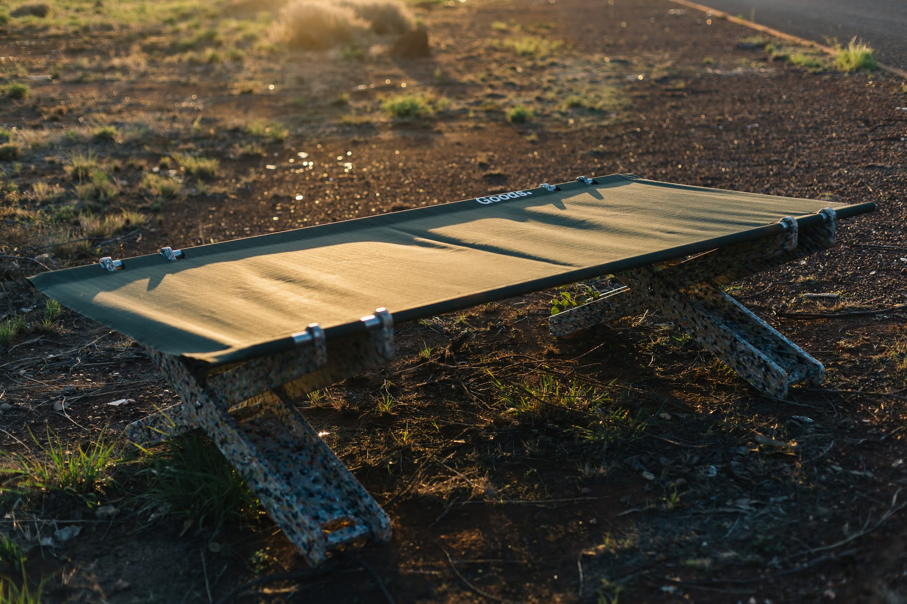
### 1.2 The unit: one bed, four things, any amount
Every dollar buys beds, so any amount reads the same way. One bed is $750. Fifty beds is a tonne of plastic. Two hundred is a community's pool.
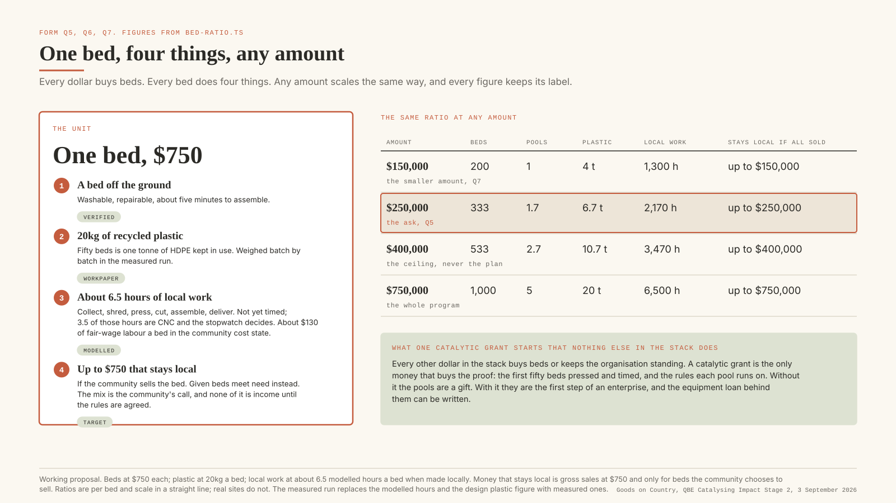
What one bed does:
- **A person off the floor tonight.** Washable, repairable, five minutes to put together. 540 delivered so far.
- **20kg of plastic out of the dump.** Fifty beds is a tonne. We weigh it properly when we press the first fifty.
- **About six and a half hours of local work** when it is made locally. Nobody has timed it yet. The first fifty beds through our press will.
- **Up to $750 that stays in the community** if they sell it. Give it away and it meets a need instead. Their call.
<table header-row="true">
<tr>
<td>Amount</td>
<td>Beds</td>
<td>Pools</td>
<td>Plastic</td>
<td>Local work, modelled</td>
<td>Stays local if all sold</td>
<td>What it is</td>
</tr>
<tr>
<td>$150,000</td>
<td>200</td>
<td>1</td>
<td>4 t</td>
<td>1,300 hours</td>
<td>up to $150,000</td>
<td>200 beds, one community's pool</td>
</tr>
<tr>
<td>$250,000</td>
<td>333</td>
<td>1.7</td>
<td>6.7 t</td>
<td>2,170 hours</td>
<td>up to $250,000</td>
<td>The smaller amount, Q7</td>
</tr>
<tr>
<td>$400,000</td>
<td>533</td>
<td>2.7</td>
<td>10.7 t</td>
<td>3,470 hours</td>
<td>up to $400,000</td>
<td>The ask, Q5</td>
</tr>
<tr>
<td>$750,000</td>
<td>1,000</td>
<td>5</td>
<td>20 t</td>
<td>6,500 hours</td>
<td>up to $750,000</td>
<td>The whole program</td>
</tr>
</table>
The table scales in a straight line. Real places do not, and the last two columns are what the model says until the first fifty beds are timed and weighed.
### 1.3 One catalyst, five loops a community controls
The funder puts money in once. Five communities each get 200 beds. From there it is theirs: what to give, what to sell, who to pay, what to build next. The money goes round inside the community. The drawing shows one community's loop, run five times.
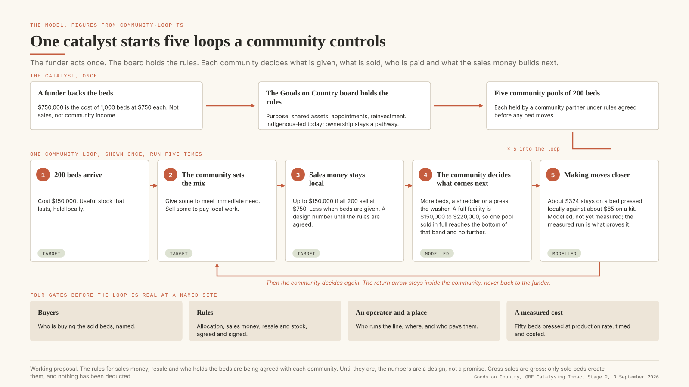
**The loop, step by step, with every figure from ****`community-loop.ts`****.**
1. **200 beds arrive.** $150,000 worth of stock that lasts, sitting in the community.
2. **The community sets the mix.** Some beds go to families who need one tonight. Some are sold.
3. **The sales money stays.** Up to $150,000 if all 200 sell at $750, less when beds are given. A design number until the rules are signed.
4. **The community decides what to build.** More beds, a shredder, a press, the washer. A full plant is $150,000 to $220,000, so one pool sold in full gets to the bottom of that range and no further.
5. **Making moves closer.** A bed made locally leaves around $200 in the community's hands, and the model says it could be about $324, against about $65 on a bought-in kit. Nobody has measured it. The first fifty beds through our press will.
Then they decide again: the next pool, the next product, washers.
**Four things have to be true before any of this is real in a place.** Someone is buying the sold beds, and we can name them. The rules are signed: who gets beds, who sells, who is paid, where the money goes. Someone runs the work, somewhere, and gets paid to. And the cost of a locally made bed has been measured.
**Two of the five steps have already happened.**
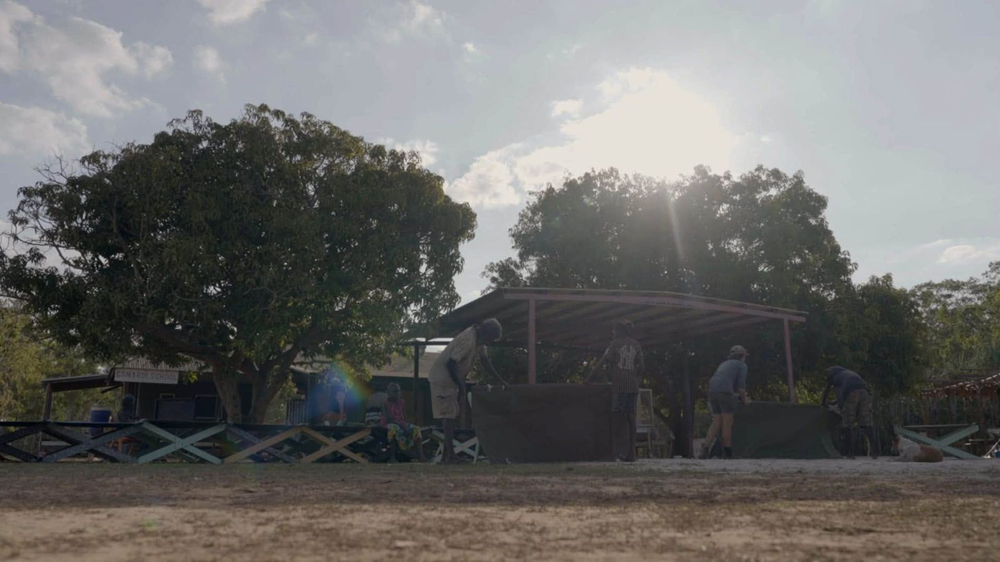
In Maningrida, Homeland School Company asked for beds and washing machines for homeland families. We pressed the plastic at the farm, packed forty kits, sent them north, and young people put every bed together in community. Those forty are the only beds we have pressed ourselves; the other 137 Stretch Beds used kits from Defy Design. Maningrida is the proof we can make them.
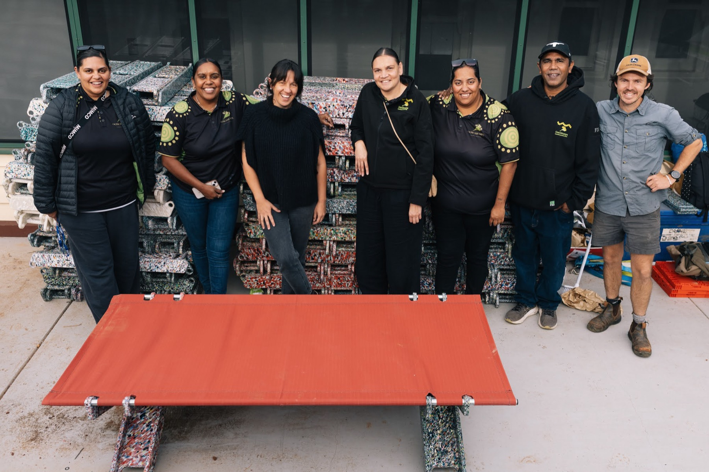
In Mparntwe, Oonchiumpa picked the young people, ran two days of building out the back of the office, chose which households got beds and who drove them out to the homelands. Some of the young people were paid for the work. Centrecorp Foundation paid for the materials. Sixteen beds stayed in town. Oonchiumpa is the proof of the work, and why the first pool goes there once Kristy has seen it.
**On speed.** A thousand beds in a quarter is eight times our biggest run. Kits can move that fast if Defy can. Our own press cannot yet, and that is what the first fifty beds will tell us.
### 1.4 Capital with three jobs
Three kinds of money, and each does one job. Money that buys beds. Money that runs the organisation. Money we borrow for the plants. One number never does two jobs: $750,000 is the cost of the beds and nothing else.
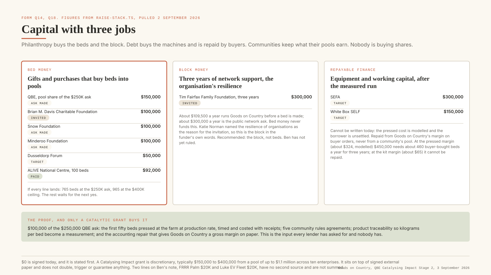
**Money that buys beds.** QBE's $400,000, Brian M. Davis up to $100,000, Snow, Minderoo, Dusseldorp, and the 100 beds ALIVE has already paid for. A bought-in kit costs about $685 delivered, so $750 leaves about $65 on a bed. Bed money makes beds and nothing else.
**Money that runs the organisation.** About $109,500 a year runs Goods on Country before a bed is made; about $300,000 a year is what we ask for publicly. Tim Fairfax invited The Butterfly Movement on 31 August to apply for $300,000 over three years, and Katie Norman said the reason is the resilience of organisations doing good work. That is this money, in her words. **Recommendation: TFFF runs the organisation and does not buy beds.** Ben has not ruled. If year one goes to beds instead, the organisation is unfunded again.
**Money we borrow for the plants.** SEFA at $300,000 and White Box at $150,000, both still conversations. Neither can be written until a locally made bed has a measured cost and the borrower is settled. It is paid back from what Goods on Country makes on buyer orders, never out of a community's pool. The catch: at around $300 a bed it takes about 460 buyer-bought beds a year for three years; at $65 a bed it cannot be repaid.
**The measured cost** comes with the first pool. The first fifty beds go through our press and get costed properly. That number is what the lenders are waiting for.
If every line lands, the thousand is covered with room to spare: 533 from QBE, 133 each from Brian M. Davis, Snow and Minderoo, 66 from Dusseldorp, 100 from ALIVE. If QBE gives $250,000 the count is 898 and the last pool waits. $0 is signed today. Two lines on Ben's note, FRRR Palm $20,000 and Luke EV Fleet $20,000, have no second source and are not counted.
### 1.5 How the grant is catalytic
Jay's read on the 2 September call: this year the Steering Committee wants to prove that corporate philanthropy can unlock investment, capital of any kind is looked on more favourably than philanthropy alone, more than one-to-one is what they want to see, and the further from $400,000 the ask sits the more likely it is. Leverage is the metric the program publishes: $1.02M of grants leveraged $2.75M in 2025, 3.7x. Last year one enterprise asked for $400,000, showed $1.1M unlocked and received $350,000.
So the answer to "what does QBE unlock" is a sequence. We never say QBE doubles, triggers or guarantees anything.
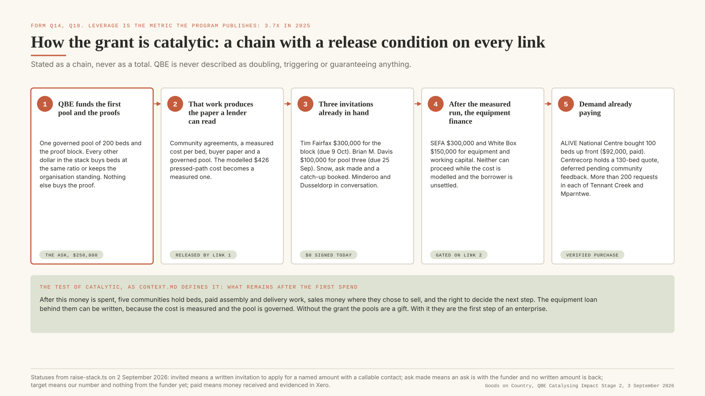
1. **QBE's beds go in first.** 533 beds into the first two communities, the first fifty through our own press so a locally made bed finally has a measured cost.
2. **The first pools give the lenders something to read.** Communities selling beds under signed rules, a cost per bed, buyer paper.
3. **Three foundations have already asked us to apply.** Tim Fairfax $300,000 over three years, due 9 October. Brian M. Davis up to $100,000, due 25 September. Snow, catch-up booked. Minderoo and Dusseldorp in conversation. $0 signed today.
4. **Then the plant money.** SEFA $300,000 and White Box $150,000 for equipment and working capital, once the cost is measured and the borrower is settled.
5. **Buyers are already paying.** ALIVE bought 100 beds up front. Centrecorp has 130 on quote, waiting on community feedback. More than 200 requests each in Tennant Creek and Mparntwe.
What is left after the money is spent is the test. Five communities holding beds, paid work assembling and delivering them, sales money where they chose to sell, and the say over what comes next. And a measured cost, so the plants can be financed.
### 1.6 Who decides what
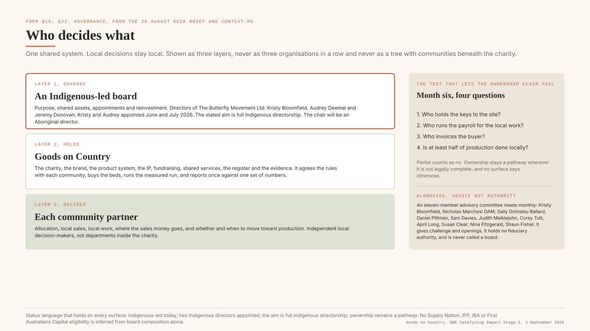
Three layers.
- **The board governs.** Purpose, shared assets, who is appointed, what gets reinvested. The directors are Kristy Bloomfield, Audrey Deemal and Jeremy Donovan. Kristy consented on 6 July and Audrey on 11 June 2026; the 20 July board meeting minuted both. The chair will be an Aboriginal director. The AGM is tentatively Monday 14 September.
- **Goods on Country holds the work.** The charity, the brand, the product, the IP, the fundraising, the shared services, the register and the evidence. It agrees the rules with each community, buys the beds, runs the first fifty through the press, and reports once a year against one set of numbers.
- **Each community decides.** Who gets beds, what is sold, who is paid, where the money goes, and whether and when to build. They are partners with their own boards. They are not part of the charity.
**Six months in, four questions.** Who holds the keys to the site. Who runs the payroll. Who invoices the buyer. Is at least half the production local. Partial counts as no. Until the answers are yes, ownership is a pathway and every page says so.
**The advisory committee** meets monthly, eleven people, and brings First Nations leadership, manufacturing, social enterprise and funder experience close to the work. It advises. It is never called a board.
### 1.7 The entity, and how the money moves
Since 28 August everything Goods sits in Goods on Country, a business name of The Butterfly Movement Ltd since 23 July 2026. Every funder's money already lands there: Tim Fairfax invited Butterfly, Brian M. Davis invited Goods On Country, Snow's grants go to Butterfly. A Curious Tractor entered the QBE cohort in March and is the historic maker, moving its assets across. The FY26 trading sits in Nic's sole trader books.
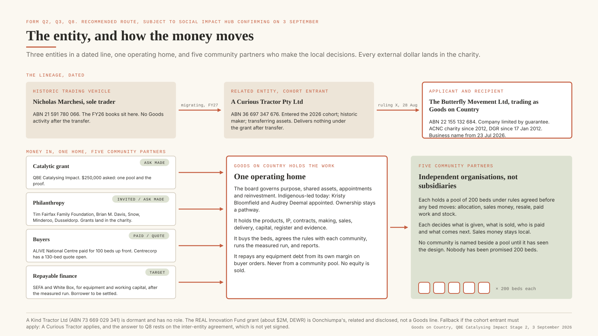
**Ruled, 5 September (Ben).** The Butterfly Movement Ltd, trading as Goods on Country, applies and receives. A Curious Tractor is listed as the related entity: cohort entrant, historic maker, moving its assets across, delivering nothing under the grant. Nicholas Marchesi, sole trader, is listed as the historic trading vehicle whose books carry FY26. A Kind Tractor Ltd is dormant and has no role.
**Fallback if Jay says the cohort entrant must apply.** A Curious Tractor applies and receives, the foundations' money lands in Butterfly, and Q2 and Q8 rest on the agreement between the two, which is not signed. That needs MinterEllison and a signature before 13 November. It is weaker, and we say so.
Either way, this is a trading enterprise and the form should read like one: beds sold at $750, ALIVE's paid order, Centrecorp's quote, and plant finance that follows the measured cost.
### 1.8 The calendar
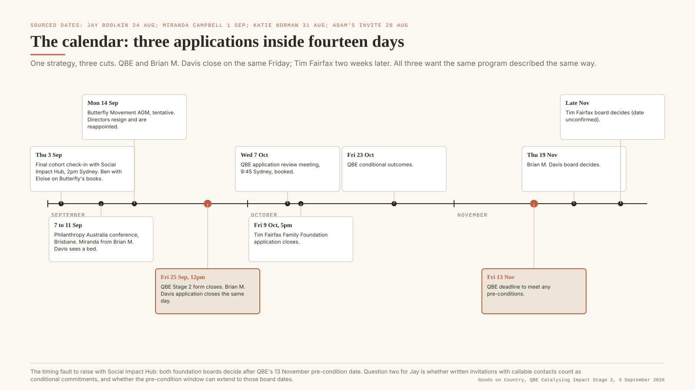
Three applications close inside fourteen days to three funders who all want the same program described the same way. One strategy, three cuts. The timing fault to raise with Jay: both foundation boards decide after QBE's 13 November pre-condition date.
### 1.9 The four gates and the measured run
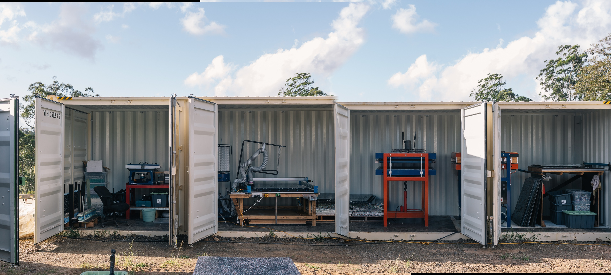
One number carries the plan and nobody has earned it. We say a bed pressed locally costs about $426 against $685 for a kit. The part prices are real invoices and the forty Maningrida beds came off our press. Nobody has made fifty in a row at working pace and kept the receipts.
So the first fifty beds of the first pool get counted properly: kilos of plastic and what it cost, press time and power, CNC hours (we think about 3.5 a bed, and we think that is where the cost hides), operator hours kept separate from founder time, scrap, freight, and what breaks. If it comes in at $426 or under, the model is right. If it comes in over, we publish it anyway and redo the maths in the open.
Open: the fifty should be a real order for a real community, so one run is the measurement and the delivery. Ben picks the community. Nic sets the window once the equipment is ready.
### 1.10 What is honest to say, and what is not
Every figure on every surface carries one of six labels, defined in `cost-story.ts`: **verified** (invoice, signed document, live register), **workpaper** (our arithmetic, checkable), **modelled** (built from verified inputs, not demonstrated), **target** (a future state), **conflict** (two figures coexist), **retired** (do not use). The rules that follow are enforced by guards that fail the build.
- $750,000 is only ever the cost of the beds. Never sales, never income, never community income.
- $0 is signed today, derived from status, and it is stated first. A line is signed only when a letter names the amount, the instrument, the funder's legal name and a person SIH can call.
- QBE is discretionary and sits on top of signed external paper. It does not match, double, trigger or guarantee anything (ruling V). $400,000 is the ask and the top of the range (Ben, 3 Sep); $250,000 is the smaller amount.
- No community is named beside a price or a pool until it has seen the design (ruling S cleared four communities to be named with what each asked for; nobody has asked for 200 beds).
- The pressed cost of about $426 and the local margin of about $324 are modelled until the measured run. "$426 is modelled from verified part prices; the first thing your money buys is the measured run that proves it."
- Plastic is 20kg a bed, workpaper, never 25kg or 45kg.
- Scabies to rheumatic heart disease is the reason the hardware matters. It is never claimed as an outcome.
- Ownership is a pathway. The 51% supplier test is never implied as met from board composition alone.
- "Designed in community", never "co-designed".
- Never "zero beds pressed in-house": forty were, for Maningrida.
## Part 2. The form, answered in the order it asks
<table header-row="true">
<tr>
<td>Question</td>
<td>Status</td>
<td>Who closes it</td>
</tr>
<tr>
<td>Q1 Enterprise name and contact</td>
<td>NEEDS BEN</td>
<td>Ben: contact person, phone, email</td>
</tr>
<tr>
<td>Q1 Entities and ABNs</td>
<td>READY</td>
<td>Jay: can Butterfly apply</td>
</tr>
<tr>
<td>Q2 How the entities connect and funds flow</td>
<td>READY</td>
<td>Jay</td>
</tr>
<tr>
<td>Q3 Structure diagram</td>
<td>READY</td>
<td>Attach diagram 01</td>
</tr>
<tr>
<td>Q4 Directors of every entity</td>
<td>READY, CONFIRM ASIC</td>
<td>Butterfly: Kristy Bloomfield, Audrey Deemal, Jeremy Donovan (Ben). Eloise confirms the ASIC extract; A Kind Tractor directors still to list</td>
</tr>
<tr>
<td>Q5 Amount</td>
<td>READY</td>
<td>400000</td>
</tr>
<tr>
<td>Q6 Use of funds</td>
<td>READY</td>
<td></td>
</tr>
<tr>
<td>Q7 Smaller amount</td>
<td>READY</td>
<td>250000</td>
</tr>
<tr>
<td>Q8 Funded activity and related entities</td>
<td>READY</td>
<td>Jay</td>
</tr>
<tr>
<td>Q9 Expected-impact document</td>
<td>NEEDS BEN</td>
<td>Export Part 1 of this page as a PDF</td>
</tr>
<tr>
<td>Q10 Impact to date and how it is measured</td>
<td>READY</td>
<td></td>
</tr>
<tr>
<td>Q11 Impact measurement materials</td>
<td>NEEDS BEN</td>
<td>Four exports, listed in Part 3</td>
</tr>
<tr>
<td>Q12 Why a document is missing</td>
<td>READY</td>
<td></td>
</tr>
<tr>
<td>Q13 Legal, compliance or regulatory matters</td>
<td>NEEDS BEN</td>
<td>Confirm "No" with every director, including the continuing Butterfly directors</td>
</tr>
<tr>
<td>Q14 Commitments from other funders</td>
<td>READY</td>
<td></td>
</tr>
<tr>
<td>Q15 Evidence of commitments</td>
<td>NEEDS BEN</td>
<td>Five files, listed in Part 3</td>
</tr>
<tr>
<td>Q16 Funder contact details</td>
<td>NEEDS BEN</td>
<td>From the invitation emails and HighLevel; not held on this page</td>
</tr>
<tr>
<td>Q17 Permission to contact funders</td>
<td>READY</td>
<td>Yes</td>
</tr>
<tr>
<td>Q18 How QBE is catalytic</td>
<td>READY</td>
<td></td>
</tr>
<tr>
<td>Q19 Readiness</td>
<td>READY</td>
<td></td>
</tr>
<tr>
<td>Q20 Financials</td>
<td>NEEDS ELOISE, NEEDS BEN</td>
<td>Butterfly's three statements; the Goods carve-out workpaper; a cover note</td>
</tr>
<tr>
<td>Q21 Why financial documents are missing</td>
<td>READY</td>
<td></td>
</tr>
<tr>
<td>Q22 Governance documents</td>
<td>NEEDS ELOISE</td>
<td>Constitution, resolutions, registers</td>
</tr>
<tr>
<td>Q23 Capital-raising materials</td>
<td>NEEDS BEN</td>
<td>The deck once aligned, the road page, the financial model</td>
</tr>
<tr>
<td>Q24, Q25 Declarations</td>
<td>NEEDS BEN</td>
<td>Sign only after Q20 and Q21 are honest</td>
</tr>
</table>
### Q1. Enterprise name, contact
**NEEDS BEN.** Enterprise name: **Goods on Country** (The Butterfly Movement Ltd, trading as Goods on Country). Nicholas Marchesi has been the cohort contact since March; Jay's emails reach the team through him. Ben to decide who signs the form and to add phone and email.
### Q1. Entities related to the enterprise
**READY.**
Applicant: **The Butterfly Movement Ltd, trading as Goods on Country.** ABN 22 155 132 684. An Australian public company limited by guarantee, registered with the ACNC as a charity since 3 December 2012 and endorsed as a deductible gift recipient since 17 January 2012. Goods on Country was registered as its business name on 23 July 2026, as part of a stewardship transition in which the charity's outgoing directors handed the entity to the Goods on Country team to become the home for this work.
Related entity: **A Curious Tractor Pty Ltd.** ABN 36 697 347 676, ACN 697 347 676. The enterprise that entered the 2026 Catalysing Impact cohort, and the historic maker and seller of Goods products. Under a decision of 28 August 2026 the products, intellectual property, assets, contracts, making, sales, delivery, capital, governance and evidence are being transferred into Goods on Country.
Related entity: **Nicholas Marchesi, sole trader.** ABN 21 591 780 066. The historic trading vehicle through which Goods activity was invoiced and received in FY2025-26 and earlier while the company structure was being established. Its FY26 books carry the Goods revenue carve-out.
Dormant, no role: **A Kind Tractor Ltd.** ABN 73 669 029 341. Not used, not a DGR pathway, listed for completeness.
Community partners, including Oonchiumpa in Alice Springs and Homeland School Company in Maningrida, are independent organisations. They are not related entities and are not subsidiaries.
### Q2. Which entity applies, how the entities connect, how funds flow
**READY.**
The Butterfly Movement Ltd, trading as Goods on Country, is the applicant and would receive the grant. Everything Goods sits there: the products, IP, assets, contracts, making, sales, delivery, capital, governance and evidence. It is Australian-incorporated, a registered charity, and the entity every co-funder in our strategy has invited or is considering: Tim Fairfax Family Foundation invited The Butterfly Movement to apply on 31 August 2026, Brian M. Davis Charitable Foundation invited Goods On Country on 1 September, and the Snow Foundation's grants land there. Placing the QBE grant in the same entity means one set of books, one board and one reporting line for the whole program.
A Curious Tractor Pty Ltd connects as the enterprise that entered this cohort and as the historic maker. It was founded by Nicholas Marchesi and Benjamin Knight, who lead Goods on Country's operating team, and it is transferring the Goods products, IP and production assets into Goods on Country. Mr Marchesi's position as a director of A Curious Tractor and as the incoming operating lead of Goods on Country was noted as a conflict of interest and managed by The Butterfly Movement board at its meeting on 20 July 2026. Nicholas Marchesi, sole trader, connects as the trading vehicle whose FY2025-26 books carry the Goods activity while the company structure was established; its Goods revenue has been carved out as a workpaper for this application.
Funds flow in one direction. Grants, gifts and DGR-eligible funding land in The Butterfly Movement Ltd and never pass through A Curious Tractor or the sole trader. Buyer orders are being moved to Goods on Country as seller of record during the transition; where an order was invoiced from the historic vehicle, that is disclosed on the invoice record. No grant money flows from the applicant to a related entity. The transfer of production equipment from the founders' historic vehicles into Goods on Country is being documented, and until it completes Goods on Country uses that equipment under an inter-entity arrangement that is being formalised with legal advice.
Capital raised elsewhere supports the enterprise in two ways. The Real Innovation Fund grant led by Oonchiumpa (about $2 million over three years, Department of Employment and Workplace Relations) is Oonchiumpa's grant, not ours; it strengthens the Alice Springs pathway where our first pool is proposed, and we disclose it here as a related interest. We do not count it. A Curious Tractor holds no capital for this program going forward.
### Q3. Structure diagram
**READY.** Attach diagram 01, "The entity, and how the money moves". It shows the three entities in a dated line, the one home, the money doors, and the five community partners drawn as independent organisations with their own boards.
### Q4. Directors of every entity
**READY (Ben, 5 September). Eloise attaches the ASIC extract.** Names must come from the ASIC and ACNC registers, not from memory, because the form exists to run them against the banned and disqualified register. What the record supports today:
- **The Butterfly Movement Ltd.** Kristy Bloomfield, Audrey Deemal and Jeremy Donovan (Ben, 3 September 2026). Kristy and Audrey were minuted as appointed to casual vacancies at the 20 July 2026 board meeting. Eloise to confirm the ASIC extract shows the same three, and whether any TABOO-period director remains on the register until the AGM on 14 September; if so, list them too.
- **A Curious Tractor Pty Ltd.** Benjamin Knight and Nicholas Marchesi OAM, per the ACT core facts record. Confirm against the ASIC extract.
- **Nicholas Marchesi, sole trader.** Not a company; Nicholas Marchesi.
- **A Kind Tractor Ltd.** Dormant. List its registered directors from ASIC for completeness.
One name on the record is unconfirmed and must not go on the form: Alexandra Savas, recorded in the site's people data as a Butterfly director from July research with no register source. Ben's earlier note "Jeremy as a Director?" is resolved: Jeremy Donovan is a director.
### Q5. Amount requested
**READY.** `400000`
533 Stretch Beds at $750: the first two communities' pools of 200 each and a start on the third. The top of the program's range, and 36% of a pool shared by ten enterprises, which is why the smaller amount in Q7 matters.
### Q6. Proposed use of funds
**READY.**
Every dollar buys beds. $400,000 is 533 Stretch Beds at $750: the first two communities' pools of 200 each and a start on the third. Each community decides how many go to families who need a bed now and how many are sold. Sales money stays in the community and goes to local work and, when there is enough of it, a production plant. The first pool is proposed for Mparntwe (Alice Springs) with Oonchiumpa, who have already built and delivered beds with the young people they work with, once they have seen and agreed the design. The rules on who gets beds, who sells, who is paid and where the money goes are agreed with each community before the beds move.
What one bed does: a person off the floor tonight; 20kg of recycled plastic kept out of the dump; about 6.5 hours of local work when it is made locally; up to $750 that stays in the community if it is sold. So $400,000 is 533 people off the floor, about 10.7 tonnes of plastic, about 3,470 hours of local work, and up to $400,000 that stays in communities if every bed is sold. The plastic and the hours are design figures today. The first fifty beds go through our own press and get costed properly, so the cost of a locally made bed becomes a measured number, which is what our lenders need before they finance the plants.
1.
2.
3.
4.
What the grant changes beyond unlocking other money. The first two communities have their pools in homes by the first quarter of 2027, each deciding its own give and sell mix. The cost of a locally made bed is measured a year earlier than if we waited for a lender. And at month six we can ask four straight questions about who controls the work at the site: who holds the keys, who runs the payroll, who invoices the buyer, and whether at least half the production is local.
### Q7. If the full amount were not available
**READY.** `250000`
With $250,000 we would buy 333 beds: the first community's pool, whole, and a start on the second. The community still sets its give and sell mix, the sales money still stays local, and the first fifty beds still go through our own press so the cost of a locally made bed gets measured. What changes is that the second community waits longer for the rest of its pool. Every dollar between $250,000 and $400,000 buys beds at the same ratio, one bed for $750.
### Q8. How the funded activity touches related entities
**READY.**
All funded activity sits in the applicant. Goods on Country buys the beds, agrees the rules with each community, runs the measured run, keeps the register and the product passport, and reports.
One funded activity depends on equipment held by a related entity during the transition. The press, shredder and CNC router at our production facility were bought by the founders through the sole trader and A Curious Tractor and are being transferred to Goods on Country. Until that transfer completes, the measured run uses them under the inter-entity arrangement described in Q2. No payment flows to a related entity for their use.
Two kinds of organisation are involved in delivering funded activity and neither is a related entity. Community partners deliver assembly, delivery and local decision-making under their pool rules, and benefit directly by design: that is the point of the program. Defy Design, a Sydney recycled-plastic manufacturer, supplies bed kits and shredded plastic as an ordinary supplier at arm's length. No related entity benefits from the grant, directly or indirectly, beyond the transfer of assets into the applicant that is already under way.
### Q9. Document outlining the expected impact of the new funds
**NEEDS BEN.** Export Part 1 of this page, with its seven diagrams, as a PDF titled "Goods on Country: one bed, four things, any amount", and attach it. Nothing new needs to be written; the model section is the document.
### Q10. Impact to date, and how it is measured
**READY.**
In two years Goods on Country and its founders have delivered 540 beds across eleven communities: 363 Basket Beds and 177 Stretch Beds, with twenty-two washing machines in community. Every bed is a unit in a live register, counted per community, and the register is the source of every count we publish. About 3,540 kilograms of recycled HDPE has gone into the Stretch Bed frames, a workpaper figure at 20kg a bed that the measured run will replace with weighed batches.
The making and the work have each been run once at scale. Forty beds for Maningrida were pressed at our facility, sent north, and assembled at Gamardi by young people with Homeland School Company, a community-controlled homeland education organisation. In Alice Springs, Oonchiumpa brought young people in for two days to build beds from flat-pack; some were paid for the work, sixteen beds stayed in town, and the rest went to the Utopia homelands. Two paying buyers have followed: ALIVE National Centre at the University of Melbourne bought one hundred beds up front, and Centrecorp Foundation holds a quote for one hundred and thirty.
We measure in two ways and keep them separate. **Numbers prove scale.** The register counts beds, washers, communities and plastic, and every published figure carries a label: verified, workpaper, modelled or target. **Voices prove meaning.** Empathy Ledger, our consent-based storytelling platform, holds interviews with people in the communities where the beds went; twenty-nine substantive interviews were analysed in July 2026 into 191 verbatim quotes coded to thirteen themes, and thirty-seven people have cleared their words for external use. The rule that joins the two: no number without a voice, and no voice reduced to a number.
The indicators we track are the four things one bed does: access to a bed off the ground, counted per unit; paid local work, counted in hours and roles; local enterprise and control, tested at month six at a site with four binary questions; and plastic kept in use, in kilograms per batch. We do not claim health outcomes. Scabies and rheumatic heart disease are the reason the hardware matters; the beds are washable and off the ground because of them, and that is where the claim stops.
Results have shaped the work at every step. The Basket Bed's failures in use produced the Stretch Bed. Repeated washing needs in Tennant Creek produced the one-button washing machine, which Elder Dianne Stokes named Pakkimjalki Kari. The most widely shared experience across the interviews, twenty-three of twenty-nine people describing a supply chain that fails them, is why the model now moves the making and the decisions to community.
### Q11. Impact measurement materials
**NEEDS BEN.** Four exports, listed in Part 3: the voice-led impact model, the register summary, the two case studies, and the public impact page.
### Q12. If a document above cannot be provided
**READY.** We do not hold a board-adopted theory of change document or an independent evaluation. What we hold instead, and attach, is the measurement method we run: a register that counts every unit, an interview corpus with per-quote consent, a claims discipline that labels every figure, and two written case studies of the making and the work. An outcomes framework in the form funders usually expect is one of the things the first pool produces: the month-six control test and the measured cost from the first fifty beds are its first two instruments.
### Q13. Legal action, criminal proceedings, compliance or regulatory enforcement
**NEEDS BEN.** The record holds nothing that meets this description for any entity or director. A Kind Tractor Ltd received an information request from the ACNC in April 2024 on a charity subtype application; that is a request, not a compliance action, and the entity is dormant. Before ticking **No**, confirm with every director of every entity listed in Q4, including the continuing Butterfly directors, and with Eloise for the TABOO Foundation period.
### Q14. Amounts committed or conditionally committed by other funders
**READY.** Lead with the standing fact and then the lines.
No external funding is signed today. What we hold is three written invitations to apply for named amounts, each from a person Social Impact Hub can call, and a paid purchase order that proves demand. Each is listed below with the type of capital, the entity that would receive it, and whether QBE funding is needed to unlock or de-risk it.
<table header-row="true">
<tr>
<td>Funder</td>
<td>Amount</td>
<td>Type</td>
<td>Receiving entity</td>
<td>Status on 3 Sep</td>
<td>Does it need QBE</td>
</tr>
<tr>
<td>Tim Fairfax Family Foundation</td>
<td>$300,000 over three years</td>
<td>Philanthropic grant, the organisation's resilience</td>
<td>The Butterfly Movement Ltd</td>
<td>Invited to apply, 31 Aug 2026 (Katie Norman). Due 9 Oct. Board late November</td>
<td>Not conditional on QBE. It funds the organisation that delivers the pools; QBE funds the first pool</td>
</tr>
<tr>
<td>Brian M. Davis Charitable Foundation</td>
<td>Up to $100,000 over 12 months</td>
<td>Philanthropic grant, pool three (youth-led)</td>
<td>Goods on Country (Butterfly)</td>
<td>Invited to apply, 1 Sep 2026 (Miranda Campbell). Due 25 Sep. Board 19 Nov</td>
<td>Buys beds at the same ratio. QBE's beds go in first</td>
</tr>
<tr>
<td>Snow Foundation</td>
<td>$100,000 to $150,000</td>
<td>Philanthropic grant, pool four</td>
<td>The Butterfly Movement Ltd</td>
<td>Ask made; a catch-up booked by Sally Grimsley-Ballard, 1 Sep</td>
<td>As above</td>
</tr>
<tr>
<td>Minderoo Foundation</td>
<td>$100,000</td>
<td>Philanthropic grant, pool five</td>
<td>The Butterfly Movement Ltd</td>
<td>Ask made</td>
<td>As above</td>
</tr>
<tr>
<td>Dusseldorp Forum</td>
<td>$50,000</td>
<td>Philanthropic grant, top-up</td>
<td>The Butterfly Movement Ltd</td>
<td>Our target; $15,000 released in June for a related event; check-in booked</td>
<td>As above</td>
</tr>
<tr>
<td>SEFA</td>
<td>$300,000</td>
<td>Repayable finance, equipment and working capital</td>
<td>To be settled with the lender</td>
<td>Cultivating. Cannot be written until the cost is measured and the borrower is settled</td>
<td>Yes. The measured cost from the first fifty beds is what a lender needs, and it comes with the first pool</td>
</tr>
<tr>
<td>White Box SELF</td>
<td>$150,000</td>
<td>Repayable finance, second lender</td>
<td>To be settled</td>
<td>Cultivating</td>
<td>Yes, as above</td>
</tr>
<tr>
<td>ALIVE National Centre, University of Melbourne</td>
<td>$92,000 ex GST for 100 beds</td>
<td>Purchase, paid</td>
<td>Historic vehicle, in transition to Goods on Country</td>
<td>Paid, confirmed 30 Aug 2026 (INV-0342)</td>
<td>No. Demand evidence, not a funding commitment</td>
</tr>
<tr>
<td>Centrecorp Foundation</td>
<td>130 beds quoted</td>
<td>Purchase</td>
<td>Goods on Country</td>
<td>Quote open, deferred pending community feedback</td>
<td>No</td>
</tr>
<tr>
<td>Real Innovation Fund (DEWR), Oonchiumpa-led</td>
<td>About $2 million over three years</td>
<td>Government grant to Oonchiumpa</td>
<td>Oonchiumpa</td>
<td>Disclosed as a related interest, not counted</td>
<td>No</td>
</tr>
</table>
Both foundation boards decide after 13 November. We are asking Social Impact Hub whether written invitations with callable contacts count as conditional commitments, and whether the pre-condition window can extend to those board dates.
### Q15. Evidence of commitments
**NEEDS BEN.** Five files, listed in Part 3. The Tim Fairfax and Brian M. Davis invitation emails are the two strongest pieces of paper we hold; the Snow letter is the shortest path to a third.
### Q16. Funder contact details
**NEEDS BEN.** Katie Norman (Tim Fairfax Family Foundation), Miranda Campbell (Brian M. Davis Charitable Foundation), Sally Grimsley-Ballard (Snow Foundation), the Minderoo contact and Rachel Fyfe (Dusseldorp Forum). Emails and phone numbers come from the invitation emails and HighLevel; they are deliberately not copied onto this page.
### Q17. Happy for SIH to contact them
**READY.** Yes.
### Q18. How QBE funding would be catalytic
**READY.**
QBE's money buys the first beds, and the first beds are what starts everything else. The first community gets its pool, sells what it decides to sell, and the money stays there and goes toward local work and a plant. The first fifty of those beds go through our own press and get costed properly, so for the first time we have a measured cost for a locally made bed. That number is what the lenders have asked for and nobody has had.
What follows, in order. Three foundations have already asked us to apply for named amounts: Tim Fairfax Family Foundation ($300,000 over three years, for the organisation), Brian M. Davis Charitable Foundation (up to $100,000, a youth-led pool) and the Snow Foundation, with Minderoo and Dusseldorp in conversation. Their beds make up the rest of the thousand. Once the cost is measured, SEFA and White Box can write about $450,000 of equipment and working capital finance for the plants, which they cannot do against a modelled number. And buyers are already paying: ALIVE bought one hundred beds up front, Centrecorp holds a quote for one hundred and thirty, and there are more than two hundred requests in each of Tennant Creek and Mparntwe.
Why it would not go the same way without QBE. The foundations are buying beds for communities, and none of them is sized to be first. The pool that a community sells and reinvests has to exist before the other pools make sense, and it has to be costed before a lender can follow it. Without that first pool the beds are gifts and the lenders have nothing to read. QBE going first is what turns a bed delivery into a community enterprise the other funders can buy into.
We do not describe the grant as matching, doubling or guaranteeing any other funding. $0 of the rest is signed today.
### Q19. Readiness to maximise impact with the funding
**READY.**
**Governance.** The Butterfly Movement Ltd has been a registered charity since 2012 with a small, clean balance sheet. Its directors are Kristy Bloomfield, Audrey Deemal and Jeremy Donovan; the AGM that completes the handover from the previous board is tentatively 14 September, with the date to be set once the auditor reports (board secretary, 1 September), and the chair will be an Aboriginal director. An eleven-member advisory committee meets monthly. It advises and does not govern. A risk register of fourteen risks with named owners exists in draft. Every quote and photo we use externally has been cleared by the person, and can be withdrawn.
**Team.** Two founders, full time, and no hires yet. The next two roles, a general manager and someone on sales, are funded from the money that runs the organisation and start when the work triggers them. QBE's volunteer team and Social Impact Hub's sessions, including the financial model built with Matt Allen and closed on 1 September, have carried a lot this year. On the ground, Oonchiumpa and Homeland School Company have already delivered with us.
**Financial systems.** Xero, a live register with a record per bed, and every published number computed from one source and checked automatically. The weakness is in Q21: the historic books have no cost of goods sold line and no gross margin, and fixing that is part of moving the enterprise into the charity.
**How fast.** Kits are available from Defy Design, so the first pool can be ordered within thirty days of the money landing. The first beds move as soon as the first community has signed its rules, and we would not skip that. The first fifty go through our own press in the first quarter after funding. The limit is scale: a thousand beds in a quarter is eight times our biggest run, kits can move that fast if Defy can, and our press cannot yet. That is why the pools go one community at a time.
### Q20. Financials
**NEEDS ELOISE, NEEDS BEN.** Upload, with a one-page cover note that says what each file is:
1. The Butterfly Movement Ltd: FY2025-26 profit and loss, balance sheet and cashflow. Small and clean per the 20 July board: about $4,000 cash, insurance prepayment netting to a matching liability, no stock, no outstanding ATO items. Audit targeted for 30 August; if the audited statements are ready, upload those.
2. A Curious Tractor Pty Ltd: FY2025-26 profit and loss and balance sheet.
3. The Goods revenue carve-out from the sole trader's FY26 books, as a labelled workpaper: $713,827 of Goods income within $1,640,724 total income, with the cost lines that belong to Goods identified. Label it a workpaper. It is not accountant-signed, and the cover note says so.
### Q21. If a financial document cannot be provided
**READY.**
The applicant's own statements are complete and small, because the enterprise has only just moved into it. The financial history of the Goods work sits in the books of Nicholas Marchesi, sole trader, alongside unrelated activity, and in A Curious Tractor Pty Ltd. We provide the Goods revenue carve-out from those books as a workpaper, unsigned. Two things in those books need saying plainly. Materials were recorded as operating expenses, so there is no cost of goods sold line and no gross margin for the bed business on paper; the per-bed economics in this application are modelled from verified part prices and will be measured in the run this grant funds. And the sole trader's balance sheet carries negative working capital that belongs to the individual's whole financial life, not to the Goods activity or to the applicant. The accounting repair in Q6 exists to end this situation.
### Q22. Governance documents
**NEEDS ELOISE.** The Butterfly Movement Ltd constitution (held in hard copy at the TABOO office and on the ACNC register), the ACNC registration and DGR endorsement, the board resolutions and minutes of 1 June and 20 July 2026 recording the transition and the director appointments, and the transition plan. A company limited by guarantee has members, so there is no shareholders agreement; supply the member register instead. For A Curious Tractor Pty Ltd: the constitution and the share register (Benjamin Knight and Nicholas Marchesi, to confirm). The inter-entity agreement between Butterfly and A Curious Tractor is being formalised and is not yet signed; say that.
### Q23. Capital-raising materials
**NEEDS BEN.** Jay's own words: "simply whatever you've already used to secure external capital, so no need to create anything new". Upload the deck once its money slides match this page, the road pitch page exported as a PDF, and the financial model built with Matt Allen. The deck is also what the review meeting on 7 October will walk through.
### Q24, Q25. Declarations
**NEEDS BEN.** The solvency declaration is made for the applicant entity, whose position is small and clean. Sign it only after Q20 and Q21 are on the form as written above, so that nothing declared is contradicted by a document attached.
## Part 3. Attachments to assemble, slot by slot
Five files per slot, ten megabytes each. Anything larger goes to [jay@socialimpacthub.org](mailto:jay@socialimpacthub.org) and [adam@socialimpacthub.org](mailto:adam@socialimpacthub.org) by email.
<table header-row="true">
<tr>
<td>Slot</td>
<td>Files</td>
<td>Owner</td>
</tr>
<tr>
<td>Q3 structure diagram</td>
<td>Diagram 01, the entity and how the money moves (PNG on this page)</td>
<td>Done</td>
</tr>
<tr>
<td>Q9 expected impact</td>
<td>Part 1 of this page as one PDF with the seven diagrams</td>
<td>Ben</td>
</tr>
<tr>
<td>Q11 impact materials</td>
<td>1. The voice-led impact model (wiki investor 12) as PDF. 2. The register summary: beds, washers, communities, plastic, with labels. 3. The two case studies, Maningrida and Alice Springs, from the site. 4. The public impact page as PDF</td>
<td>Ben</td>
</tr>
<tr>
<td>Q15 evidence of commitments</td>
<td>1. Katie Norman's invitation email, 31 Aug 2026. 2. Miranda Campbell's invitation email, 1 Sep 2026. 3. ALIVE invoice INV-0342 and the remittance. 4. Centrecorp quote QU-0014. 5. The Snow letter, once it exists</td>
<td>Ben</td>
</tr>
<tr>
<td>Q20 financials</td>
<td>1. Butterfly P&L. 2. Butterfly balance sheet. 3. Butterfly cashflow. 4. A Curious Tractor P&L and balance sheet. 5. The Goods carve-out workpaper with the cover note</td>
<td>Eloise, Ben</td>
</tr>
<tr>
<td>Q22 governance</td>
<td>1. Butterfly constitution. 2. ACNC registration and DGR endorsement. 3. Board resolutions and minutes, 1 Jun and 20 Jul 2026. 4. Member register. 5. A Curious Tractor constitution and share register</td>
<td>Eloise, Ben</td>
</tr>
<tr>
<td>Q23 capital-raising materials</td>
<td>1. The deck as PDF, once aligned. 2. The road pitch page as PDF. 3. The financial model. 4. The one-page leave-behind</td>
<td>Ben</td>
</tr>
</table>
## Part 4. What only people can close
### For Jay, today at 2pm, in this order
1. Can The Butterfly Movement Ltd (Goods on Country) be the applicant and recipient, given the cohort entrant was A Curious Tractor and the work has moved?
2. Do written invitations to apply for a named amount, with callable contacts and boards deciding after 13 November, count as conditional commitments, and can the pre-condition window extend to those board dates?
3. Does a letter subject to board or credit approval count?
4. What must the accountant's letter cover: the applicant, the carve-out, or both?
5. Is the Oonchiumpa-led Real Innovation Fund grant a commitment, a conflict to disclose, or neither?
### For Ben
- [ ] Tim Fairfax to the block or to the beds. Recommendation: the block.
- [ ] Confirm the tiers as written: $250,000 ask, $150,000 smaller amount, $400,000 ceiling never presented.
- [ ] Which community may be named against the first pool. Recommendation: Oonchiumpa, with Kristy, once she has seen the design; until then the form says "one community partner" and names Alice Springs as proposed.
- [ ] Pick the community the fifty measured-run beds go to, so the run is the measurement and the delivery at once.
- [ ] FRRR Palm $20,000 and Luke EV Fleet $20,000: what they are. Until then they are not summed anywhere.
- [ ] Who owns the QBE volunteer project.
- [ ] Q1 contact person, phone, email. Q13 confirmation with every director. Q16 contact details from the invitation emails.
- [ ] The Q20 cover note, and the decision to sign Q24 and Q25 only after it.
- [ ] The exports in Part 3, and the deck's money slides brought to this page before Q23 is uploaded.
### For Eloise, today
- [ ] Butterfly's FY26 profit and loss, balance sheet and cashflow, audited if ready.
- [ ] The current ASIC extract for Butterfly, to confirm it shows Kristy Bloomfield, Audrey Deemal and Jeremy Donovan and nobody else.
- [ ] Constitution, ACNC registration, 1 June and 20 July resolutions and minutes, member register.
- [ ] Confirm the AGM date and whether the form should be submitted before or after it.
### For Nic
- [ ] The FRRR Community Led Climate Solutions award letter and amount (won per Steph Pearson, 16 July; nothing in the record). Possibly the first signed paper.
- [ ] Real press cadence, cycle times and expected scrap for the measured run, and the window once the equipment is finished.
- [ ] Whether Defy Design can supply kits for the first pool inside a quarter.
- [ ] The Centrecorp quote: what "deferred pending community feedback" needs to move.
### The submission blocker, unchanged since 1 August
The accountant's letter. It cannot be signed until the cost of goods sold and unclassified income problems in the historic books are fixed, and nothing on this page fixes them. Question four for Jay decides how much of it the application needs.
## Part 5. From this page to the deck
The Pencil deck (`Goods Final Deck.pen`) already follows the spine: ambition, problem, road, product, making, proof, governance, program, mechanism, decision. What this page adds is the drawn model. Each diagram maps to a slide, and the copy on the slide should be the copy on this page so that no figure does two jobs.
<table header-row="true">
<tr>
<td>Slide</td>
<td>What it carries</td>
<td>Source on this page</td>
</tr>
<tr>
<td>07 Governance before capital</td>
<td>Three layers, status strip, applicant footer after Jay</td>
<td>1.6 and diagram 05</td>
</tr>
<tr>
<td>08 First capital becomes local choice</td>
<td>The catalyst row; $750,000 as the cost of the beds only</td>
<td>1.3, top of diagram 03</td>
</tr>
<tr>
<td>08C The loop, in one drawing</td>
<td>Five steps, the return arrow, four gates</td>
<td>1.3 and diagram 03</td>
</tr>
<tr>
<td>09 One pool, three uses</td>
<td>Give some, sell some, decide again; no dollar figure</td>
<td>1.3</td>
</tr>
<tr>
<td>09C What changes, and how we know</td>
<td>Four things that change, four instruments, the labels</td>
<td>Q10 and 1.10</td>
</tr>
<tr>
<td>10 Capital with three jobs</td>
<td>Bed money, block money, repayable finance, the proof band, $0 signed</td>
<td>1.4 and diagram 04</td>
</tr>
<tr>
<td>10C One bed, four things, any amount</td>
<td>The unit card and the scale table</td>
<td>1.2 and diagram 02</td>
</tr>
<tr>
<td>11 The first pool builds the next capability</td>
<td>The four steps; Oonchiumpa named only once Kristy has seen the pool</td>
<td>1.3, Q6</td>
</tr>
<tr>
<td>12 Back the first pool</td>
<td>The decision: $250,000, one pool and the proof; $150,000 proves half; three invitations in hand, $0 signed</td>
<td>Q5, Q7, Q18</td>
</tr>
<tr>
<td>Appendix: the chain</td>
<td>Five links with release conditions, for the review meeting</td>
<td>1.5 and diagram 06</td>
</tr>
<tr>
<td>Appendix: the entity</td>
<td>Three entities, one home, five partners; QBE cut only</td>
<td>1.7 and diagram 01</td>
</tr>
<tr>
<td>Internal only: the calendar</td>
<td>Never a deck slide; the working wall</td>
<td>1.8 and diagram 07</td>
</tr>
</table>
The diagram sources are SVG files generated from one script in the repo (`deliverables/qbe-stage2/diagrams/build.mjs`), drawn in the deck's own tokens (cream, ink, terracotta, sand, sage; Playfair Display and Inter), so they can be redrawn as Pencil layers or dropped in as images. When a figure changes in `raise-stack.ts`, `community-loop.ts` or `bed-ratio.ts`, the script is the place to change it, and this page follows.
---
