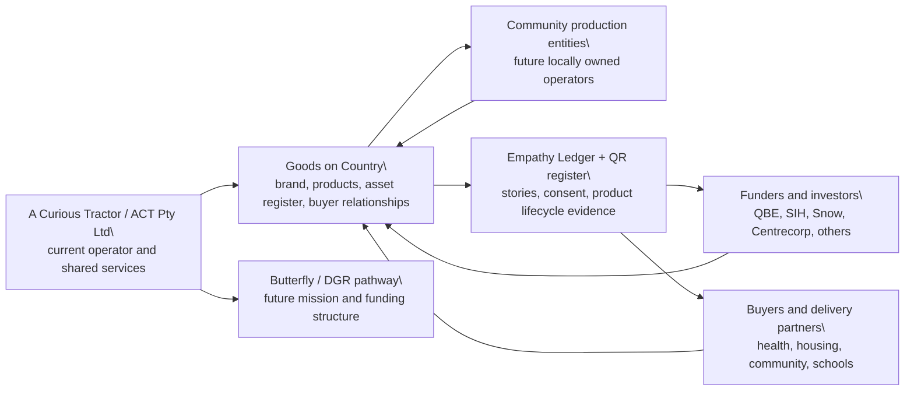

# QBE Diagnostic Area 01 - Vision & Ambition

## Diagnostic read

**Diagnostic score:** current 8, target 9, gap 1.

The SIH / QBE diagnostic reads vision as a strength. The founders clearly articulated the mission, the philosophy of repairability/washability/durability, the short-term direction to deploy the next On-Country production facility, and the long-term ownership pathway where Aboriginal-controlled or locally owned production entities run production, recycling and maintenance on Country.

The gap is not a lack of vision. The gap is making the relationship between Goods on Country, ACT, Butterfly, future community-controlled production entities, parent shared services, governance, accountability, capital and benefit flow explicit enough that an investor or funder can understand it without a live founder explanation.

## Current evidence reviewed

### Diagnostic and Notion

- Diagnostic PDF: `ACT_GOC Impact Investment Diagnostic V4 130526.pdf`, created 13 May 2026, 10 pages.
- Goods HQ: https://www.notion.so/177ebcf981cf805fb111f407079f9794
- SIH Diagnostic Readiness Hub: https://www.notion.so/36debcf981cf814a8de1cd5da6d3387d
- QBE Documentation Readiness - Deep Dive: https://www.notion.so/36debcf981cf818e968de440ad7b9203
- QBE Diagnostic Artifact Database: https://www.notion.so/cb3794d427914d72bf1036106d8116f5
- Local wiki source: `wiki/articles/enterprise/01-vision-and-ambition.md`
- Meeting brief: `wiki/outputs/2026-05-28-qbe-meeting-alignment-brief.md`
- Brand/admin review: `wiki/outputs/brand-review-2026-05-28/BRAND-ADMIN-REVIEW.md`

### Public website links

- Home: https://www.goodsoncountry.com/
- About: https://www.goodsoncountry.com/about
- Story: https://www.goodsoncountry.com/story
- Stretch Bed: https://www.goodsoncountry.com/stretch-bed
- Stretch Bed shop: https://www.goodsoncountry.com/shop/stretch-bed-single
- Process / how it is made: https://www.goodsoncountry.com/process
- Press and brand pack: https://www.goodsoncountry.com/press
- Partner: https://www.goodsoncountry.com/partner
- Oonchiumpa partner page: https://www.goodsoncountry.com/partners/oonchiumpa
- Centrecorp partner page: https://www.goodsoncountry.com/partners/centrecorp
- Public Stretch Bed wiki: https://www.goodsoncountry.com/wiki/products/stretch-bed

### Admin links to use as proof, not as the public story

- Admin dashboard: https://www.goodsoncountry.com/admin
- Assets register: https://www.goodsoncountry.com/admin/assets
- Production: https://www.goodsoncountry.com/admin/production
- Cost model: https://www.goodsoncountry.com/admin/cost-model
- Photos: https://www.goodsoncountry.com/admin/photos
- Photos browser: https://www.goodsoncountry.com/admin/photos-browser
- Library: https://www.goodsoncountry.com/admin/library
- Funders: https://www.goodsoncountry.com/admin/funders
- Deals: https://www.goodsoncountry.com/admin/deals
- Reports: https://www.goodsoncountry.com/admin/reports

## Current data evidence

### v2 Supabase asset register

Queried directly from the v2 Supabase project using the service role key from `v2/.env.local`, not the Supabase MCP.

As of 28 May 2026:

| Metric | Verified count | How to use it |
|---|---:|---|
| Asset rows | 561 | Internal proof of register maturity |
| Total asset quantity | 674 | Internal proof, not a simple public headline |
| Bed quantity | 633 | Use as "beds tracked" if product mix is explained |
| Deployed beds | 496 | Strongest current "beds in homes/on Country" count |
| Stretch Bed quantity | 270 | Use for flagship product scale, distinct from Basket Bed |
| Basket Bed quantity | 363 | Archive/open-source history, not the current product |
| Washing-machine asset quantity | 41 | Prototype/asset count, not retail product claim |
| GB0-156 batch | 107 | 87 deployed, 20 ready |

Deployed beds by community:

| Community | Deployed beds |
|---|---:|
| Tennant Creek | 159 |
| Utopia Homelands | 147 |
| Palm Island | 131 |
| Kalgoorlie | 20 |
| Maningrida | 18 |
| Alice Springs | 16 |
| Canberra | 2 |
| Mount Isa | 2 |
| Darwin | 1 |

### Empathy Ledger media and story evidence

Queried from the configured Goods Empathy Ledger project.

As of 28 May 2026:

| Metric | Count |
|---|---:|
| Goods project stories | 376 |
| Stories with media | 345 |
| Public stories with media | 124 |
| Public media stories with explicit consent or elder review resolved | 124 |
| Media assets | 95 |
| Public image assets | 68 |
| Public video assets | 22 |
| Public audio assets | 5 |

Top useful tags include `trip:may-2026`, `product:stretch-bed`, `community:utopia-homelands`, `event:bed-delivery`, `community:alice-springs`, `event:alice-build`, and `batch:156`.

## Claim discipline for area 01

| Claim | Status | Use externally? | Notes |
|---|---|---|---|
| Goods has a clear mission and ambition | Verified | Yes | Directly supported by diagnostic. |
| Stretch Bed is the flagship live product | Verified | Yes | Canonical in `products.ts` and public product pages. |
| Stretch Bed is recycled HDPE, galvanised steel and heavy-duty canvas | Verified | Yes | Source: `v2/src/lib/data/products.ts`. |
| Stretch Bed weighs 26kg, supports 200kg, assembles in about 5 minutes | Verified | Yes | Source: `products.ts`. |
| 496 deployed beds are in the asset register | Verified | Yes, with date | Use as a dated point-in-time number. |
| 633 bed assets are tracked | Verified | Yes, if product mix is explained | Includes current Stretch Bed and archived Basket Bed. |
| 520+ beds across Australia | Mixed | Only after canonical decision | Static public copy says 520+, database says 633 bed assets and 496 deployed beds. |
| 600+ beds shipped | Mixed | No until reconciled | Appears in funder/shared content but should be reconciled. |
| Made On-Country | Mixed | Use carefully | Some current HDPE inputs are still Defy/Sydney path; On-Country production is the model/pathway. |
| Community ownership pathway | Target | Yes, as pathway | Do not say ownership is complete. |
| Butterfly/community entity model | Future/target | Internal/founder review | Needs legal structure memo. |
| Future fridge/HDPE catalogue | Future | No for this page | Keep out of the vision opener unless asked about product roadmap. |

## Public copy risks found

- Public pages use inconsistent count language: `400+`, `520+`, `600+`, and current database counts do not all mean the same thing.
- The clean current language is: "496 deployed beds in the register and 633 bed assets tracked as of 28 May 2026." For a public rounded line, choose one deliberate number and define it.
- Some copy says or implies broad "Made On-Country" even though `products.ts` says recycled HDPE plastic panels are currently `Defy Design, Sydney (current) / On-country (future)`.
- The brand guide bans "co-design", but some data/content still uses the term or theme internally. Public copy should say "designed in community" or "community-led design".
- Supabase `products` still contains inactive `weave-bed-double` with `product_type: weave_bed`. It is inactive, but it is a data cleanup risk.
- Supabase `products` has an active `smoke-test` product. Confirm it cannot surface publicly.

## Media and image picks

Use image proof in this order:

| Role | Asset |
|---|---|
| Hero proof | `/images/media-pack/lying-on-stretch-bed.jpg` or `/images/product/stretch-bed-hero.jpg` |
| Product detail | `/images/product/stretch-bed-overview.png`, `/images/pitch/bed-poles.jpg`, `/images/pitch/bed-canvas.jpg`, `/images/pitch/bed-frame-legs.jpg` |
| Assembly proof | `/video/stretch-bed/assembly.mp4`, `/images/product/stretch-bed-assembly.jpg`, `/images/media-pack/community-bed-assembly.jpg` |
| Production proof | `/images/process/shredded-plastic-tubs.jpg`, `/images/process/heat-press-detail.jpg`, `/images/process/cnc-cutting-closeup.jpg`, `/images/process/pressed-sheets-stacked.jpg` |
| Community proof | `/images/people/xavier-stretch-bed-alice-springs.jpg`, `/images/people/dianne-stokes.jpg`, `/images/partners/centrecorp/utopia/hero-elder-bed.jpg` |
| QBE/program proof | `/images/program/qbe-cover-letter-photo.jpeg`, `/qbe/cohort-photo.jpeg` |

Before any external pack: check consent status for identifiable people and mark whether the image is public, funder-only, internal, or needs review.

## Founder narrative draft

Goods on Country started with a practical question: what if the things people need for health in remote homes were designed with the people who use them, built for the conditions, and eventually owned closer to Country?

The first proof is the Stretch Bed. It is a flat-packable, washable bed made from recycled HDPE, galvanised steel and heavy-duty Australian canvas. It weighs 26kg, supports 200kg, assembles in about five minutes with no tools, and is tracked through a QR-linked asset register. The current v2 register shows 633 bed assets tracked and 496 deployed beds as of 28 May 2026. The flagship product is live. The asset system is live. The community evidence is visible in the stories, photos and delivery records.

The bigger ambition is not to keep ACT as the permanent centre of the work. The diagnostic was right to identify that the vision is strong, but the model needs to be mapped more clearly. The next phase is to show how ACT, Goods, Butterfly, funders, buyers, advisors and community-controlled production entities relate to one another. The destination is distributed production: local people collecting plastic, pressing sheet, making parts, assembling beds, maintaining records, and holding more of the value. ACT remains useful only where shared services, design, research, capital access, quality systems and back-office support are genuinely needed.

For QBE and SIH, the honest position is this: the vision is not the gap. The artifact layer is the gap. We now need a founder-authored 1-3 page strategy narrative and an operating model diagram that makes the work legible without overclaiming what is still in progress.

## Operating model to build

The diagram needs a founder/legal pass before external use. It must clarify:

- contracting party now,
- future investee entity,
- what ACT keeps providing,
- what Butterfly does and does not do,
- who owns IP and production equipment,
- how community production entities receive training and value,
- what triggers ownership transfer or licensing/benefit-share,
- what reporting flows back to funders and buyers.

## Artifacts to build next

### Evidence artifact: Goods in one page

Sections:

1. Why Goods exists.
2. What is already real.
3. What the next phase must make legible.

Must include:

- one flagship product image,
- one production image,
- one community proof image,
- 5 verified facts,
- 3 source links,
- claim labels for anything target/future.

### Decision artifact: operating model diagram

Deliverable:

- one diagram,
- one paragraph explaining current state,
- one paragraph explaining target state,
- one table of open legal/governance decisions.

### Data/modelling work

- Define canonical public bed count and wording: deployed beds vs tracked bed assets vs shipped beds.
- Reconcile 400+ / 520+ / 600+ across public pages.
- Build a current-state count block from Supabase rather than static copy.
- Decide whether "Made On-Country" means made, assembled, designed, or target production pathway on each page.
- Clean inactive `weave_bed` and active `smoke-test` product risk from public product surfaces if they can leak.

## Page-by-page build recommendation

For area 01, the strongest public route stack is:

1. `/about` - best concise public narrative, but update counts and refine "Made On-Country".
2. `/stretch-bed` - best product proof route, but lazy screenshot review showed some below-fold media needs a scroll QA pass and local dev swap controls are noisy.
3. `/process` - best production proof route, but needs canonical "current vs future" wording and image-loading QA.
4. `/press` - useful press/brand source, but counts are currently stale at 400+.
5. `/partner` - useful model/funder framing, but some claims should be checked against the current count and cost model.

Do not use `/story` as the main investor opener yet. It is emotionally strong but long, and it contains older count language and broader product narrative that needs tightening.

## Founder review questions

1. What public number do Ben/Nic want to defend tomorrow: 496 deployed beds, 633 bed assets tracked, or a rounded public number with a clear definition?
2. Which phrase is accurate today: "Made On-Country", "designed in community and assembled On-Country", or "moving production On-Country"?
3. Is Butterfly part of the meeting narrative tomorrow, or should it stay in the legal/governance artifact only?
4. Which three images are consent-cleared and strongest for the 1-page founder narrative?
5. Should the operating model describe "community ownership transfer", "community-controlled production entities", or "locally owned operating entities"?

## Verification log

- PDF metadata checked with `pdfinfo`: 10 pages, created 13 May 2026.
- PDF text checked with `pdftotext`: area 01 diagnostic strengths and opportunities extracted.
- v2 code reviewed: public routes, admin routes, `products.ts`, `content.ts`, `media.ts`, admin sidebar, Supabase helpers.
- v2 Supabase queried directly with service role from `.env.local`, not Supabase MCP.
- Empathy Ledger queried through configured Supabase URL/key.
- Local app checked at `localhost:3011`; screenshots captured to `tmp/qbe-area01-screenshots/`.
- No production deployment or live external HTTP crawl was performed in this pass.
