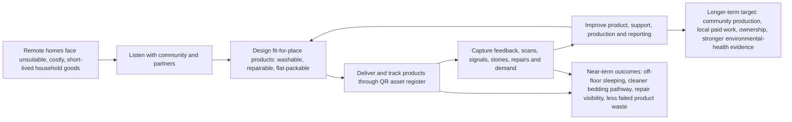

# 02 - Social Objective & Impact Measurement

## Diagnostic read

**Diagnostic score:** current 5, target 8, gap 3.

The diagnostic treats impact measurement as a priority gap. Goods has a clear social problem, strong field evidence, asset-register proof, and a consent-led story direction. The investor-readiness gap is not "find more mission". The gap is a tighter Theory of Change, a short metric set, and disciplined claim labels that separate tracked evidence from modelled benefits, targets, and future longitudinal outcomes.

## What I reviewed

### Notion and wiki

- Goods HQ: https://www.notion.so/177ebcf981cf805fb111f407079f9794
- SIH Diagnostic Readiness Hub: https://www.notion.so/36debcf981cf814a8de1cd5da6d3387d
- Impact Claim Map: https://www.notion.so/358ebcf981cf810bb68dcc6f8913d317
- Existing wiki mirror: https://www.notion.so/355ebcf981cf8189a34ec1dfea478b8d
- `wiki/articles/impact/theory-of-change.md`
- `wiki/articles/impact/metrics-tracked.md`
- `wiki/articles/impact/empathy-ledger-impact.md`
- `wiki/articles/impact/impact-measurement-report.md`
- `wiki/articles/enterprise/02-social-objective-impact.md`
- `wiki/outputs/2026-05-12-impact-page-audit.md`

### Website and admin routes

- Public/gated impact: https://www.goodsoncountry.com/impact
- Local impact login proof: http://localhost:3012/impact/login?from=%2Fimpact
- Asset register admin: https://www.goodsoncountry.com/admin/assets
- Reports admin: https://www.goodsoncountry.com/admin/reports
- EL stories admin: https://www.goodsoncountry.com/admin/el-stories
- QR/bed journey example: https://www.goodsoncountry.com/bed/GB0-156-40
- Recipient handover guide: https://www.goodsoncountry.com/wiki/guides/recipient-handover

## Current evidence snapshot

Queried directly from the v2 Goods Supabase project on 28 May 2026 using `.env.local` and `@supabase/supabase-js`. Supabase MCP was not used.

| Evidence point | Current state | Claim label | Use externally? |
|---|---:|---|---|
| Asset rows | 561 | verified | Yes, if row-vs-quantity is explained |
| Total asset quantity | 674 | verified | Yes, dated |
| Bed asset quantity | 633 | verified | Yes, if product mix is explained |
| Stretch Bed quantity | 270 | verified | Yes, dated |
| Deployed bed quantity | 496 | verified | Yes, dated |
| Washing-machine asset quantity | 41 | verified | Use as prototype asset count, not retail product proof |
| Distinct communities in asset table | 10 | verified | Yes, dated |
| Rows with QR URLs | 558 rows / 671 quantity | verified | Yes |
| Bed scans | 229 total / 51 human non-admin | verified | Yes, as QR engagement proof |
| Bed signals | 8 total: 4 pulse, 4 name-change | verified | Internal and selective external |
| User asset claims | 0 | verified | Internal only for now |
| GPS rows | 40 | verified | Internal until coverage improves |
| Asset rows with photos | 119 | verified | Use only with consent checks |
| Install photo rows | 0 | verified | Internal gap |
| Recipient consent rows in asset table | 0 | verified | Internal gap |
| Public display names | 3 | verified | Use carefully |
| Bed journey events | 18 | verified | Good proof surface, needs broader coverage |
| Raw usage log cycle_complete rows | 1,920 | partial | Internal until reconciled |
| Fleet KPI cycles | 17 | partial | Internal until reconciled |
| Fleet online | 1 of 13 machines, 11 open alerts | partial | Use as a build gap, not a strong impact claim |

### Empathy Ledger evidence

Queried from the configured Goods Empathy Ledger project.

| Evidence point | Current state | Claim label | Use externally? |
|---|---:|---|---|
| Stories | 376 | verified | Yes as internal evidence base |
| Public stories | 134 | verified | Yes, after story-level review |
| Explicit-consent stories | 376 | verified | Yes, still audit context before reuse |
| Pending elder review | 221 | verified | Internal caution |
| Story types | 221 delivery evidence, 121 gallery photos, 24 personal narratives, 9 video testimonials, 1 voice | verified | Useful split |
| Admin EL prose surface | 34 total, 13 public, 0 pending elder | verified from `/admin/el-stories` | Yes as curated editorial surface |
| Media assets | 95 active public assets: 68 image, 22 video, 5 audio | verified | Needs media-level consent audit |
| Media consent flags | 95 show consent flags false in `media_assets` | risk | Do not bulk-use without checking story/EL consent context |

## Two-column impact claim artifact

### Public claims ready for website/funders

| Public claim | Label | Evidence to point at | Guardrail |
|---|---|---|---|
| Goods addresses a repeated practical problem: appropriate beds, washable bedding, repairable goods, freight, and failed products in remote community contexts. | verified / founder framing | Diagnostic, enterprise wiki, community story base | Keep problem practical; avoid charity framing. |
| The Stretch Bed is a live product designed for remote conditions: washable canvas, galvanised steel, recycled HDPE, 26kg, 200kg capacity, no-tool assembly. | verified | `v2/src/lib/data/products.ts`, `/stretch-bed`, `/shop/stretch-bed-single` | Do not describe it as a prototype. |
| Goods has 496 deployed beds and 633 bed assets tracked in the v2 register as of 28 May 2026. | verified | v2 Supabase `assets` table | Define deployed vs tracked; explain product mix. |
| Goods has QR-linked asset infrastructure: 558 asset rows with QR URLs, covering 671 quantity. | verified | v2 Supabase `assets.qr_url`; `/bed/{id}` pages | QR tracking supports measurement; it does not prove outcomes by itself. |
| QR pages are being scanned: 229 total bed scans, including 51 human non-admin scans. | verified | `bed_scans` table | Use as activity evidence, not wellbeing evidence. |
| Recipient-facing QR pages can capture pulse feedback, demand bumps, help requests, photo sharing, naming, and claims. | verified system proof | `/bed/GB0-156-40`, API routes, handover guide | Current usage is early; avoid implying mature adoption. |
| Goods has a consent-led story base in Empathy Ledger: 376 stories, 134 public stories, 34 curated admin prose items. | verified | EL project and `/admin/el-stories` | Story/media reuse still needs human consent/context review. |
| Goods can report delivery outputs to funders today through `/admin/reports`. | verified system proof | `/admin/reports`, funder report generator | Reports need provenance cleanup before broad investor use. |
| Each Stretch Bed uses 20kg HDPE in current product data. | modelled from product spec | `products.ts`, impact model | Use "20kg per bed" not audited total waste diversion unless weighing is added. |
| Beds and washing machines are designed to support sleep, hygiene, dignity, repair, and environmental-health conditions. | logic claim | Theory of Change, health partner notes, product specs | Do not claim measured health outcomes. |

### Internal claims requiring collection before external use

| Internal claim | Why not external yet | Data to collect/build | Owner pathway |
|---|---|---|---|
| Goods improves measured wellbeing, sleep, safety, dignity, or household health outcomes. | No longitudinal measured outcome dataset yet. | Baseline/follow-up check-ins, consented story summaries, partner observations. | MEL framework + QR check-ins. |
| Stretch Beds reduce scabies, RHD, or other clinical outcomes. | Health logic is plausible but not measured clinically. | Health partner protocol, independent evaluation design, ethically scoped indicators. | Health partner + SIH/PIN advice. |
| Government health savings from prevented RHD cases. | Currently speculative model in impact code. | Explicit assumptions, health-economics review, evidence chain. | Internal model only until reviewed. |
| 95% product survival rate. | Current impact model says estimate; not broad 12/24/36-month survival data. | Survival check-ins by batch, repair/replacement events, retired/damaged asset tags. | Asset register + QR pulse flow. |
| "Every number is live." | False. `/impact` currently mixes verified, modelled, estimated, partial and design target metrics. | Add provenance field/rendering and page copy changes. | Website fix. |
| Full washing-machine telemetry impact. | Fleet KPI shows 1 of 13 machines online; raw cycle logs and KPI cycle totals conflict. | Reconcile telemetry source, reconnect machines, define reporting metric. | Fleet tooling + ops report. |
| Community-owned production is operating at scale. | Current path is future/target, not complete proof. | Entity agreements, plant operation logs, paid hours, community revenue share. | Governance/legal + production. |
| Large local employment and skills outcomes. | Production hours are currently modelled from assumptions. | Timesheets, paid role logs, training completion, community operator records. | Production SOP + payroll/Xero. |
| Asset-level install photos and recipient consent. | Asset table shows 0 install photo rows and 0 recipient consent rows. | Handover photo flow, consent fields, EL linkage. | Field handover SOP. |
| Public media can be reused freely. | EL story consent looks strong, but `media_assets` consent flags are false across 95 assets. | Media-by-media consent/elder/context audit. | EL admin + photo review. |
| User claim flow is active at household scale. | `user_assets` currently has 0 claims. | Handover script usage, phone-login adoption, follow-up reminders. | QR journey. |

## Theory of Change

## Priority metric shortlist

Keep Area 02 to 7 metrics for QBE/SIH. Everything else can sit behind these as supporting detail.

| Metric | Label | Source | Why it matters |
|---|---|---|---|
| Deployed products by product/status | verified | v2 `assets` table | Core operating proof. |
| Communities/places served | verified | v2 `assets.community`, `community_id`, `place` | Keeps evidence place-specific. |
| QR-linked assets and scans | verified | `assets.qr_url`, `bed_scans` | Shows product-level tracking exists and is used. |
| Product condition/support signals | emerging verified | `bed_signals`, support routes, repair notes | Turns delivery into aftercare. |
| Consented stories/media available for reporting | verified with consent audit | Empathy Ledger stories/media | Adds community voice without extraction. |
| Material diverted per verified bed | modelled | `20kg HDPE × verified bed count` | Environmental claim discipline. |
| Washer telemetry and uptime | partial | `usage_logs`, fleet KPI RPC | Important but not mature enough for headline claims. |

## Three report products to build

| Report product | Audience | Should include | Should exclude |
|---|---|---|---|
| Buyer report | Institutional buyer / procurement team | Beds delivered, QR pages, warranty/support pathway, freight/route notes, current stock/next batch, contracting party, photos only where consented. | Health outcomes, government savings, unverified community quotes. |
| Funder report | Philanthropic/corporate funder | Period outputs, budget/use-of-funds, asset IDs, communities, consented story excerpts, modelled environmental line, risks/gaps, next ask. | "Every number live", unaudited plastic totals, unreviewed media, speculative disease reduction. |
| Internal ops report | Ben/Nic/field team | Missing QR, missing GPS, missing install photos, missing consent, bed scans, bad pulses, demand bumps, offline telemetry, unreconciled report copy. | Polished narrative; this should be a fix queue. |

## Page-by-page website/admin review

### `/impact`

Useful, but high-risk. The current page code still uses "Live Data", "measured in real time", and "Every number is live". That directly repeats the diagnostic issue. `impact-model.ts` also lacks a rendered provenance field in the current code, despite the 2026-05-12 audit saying provenance badges had shipped. This page should be fixed before a funder sees it.

### `/api/impact`

Useful internal proof, but currently gated by the impact password flow in local testing. The underlying `fetchImpactData()` mixes live asset counts, computed sleep nights, computed plastic, estimated survival, manual FTE, speculative government savings, and partial fleet data. It should not be described as a clean live impact API until provenance is explicit.

### `/admin/assets`

Very useful. This is the core operational proof surface. It shows active records, status pipeline, QR links, scans, batches, and telemetry last-seen. Caution: many admin counts are row counts, while investor counts often need quantity sums. The report needs a row-count vs quantity-count rule.

### `/admin/reports`

Useful and close to the funder-report artifact. It currently has Centrecorp and Snow report generation. The generator resolves metric placeholders from Goods Supabase, ACT infra Xero, and EL. Caution: the existing generated reports contain some stale/risky language such as 25kg plastic per bed, fridge expansion, and "live production data" wording that should be labelled or updated.

### `/admin/el-stories`

Useful curated story surface. It intentionally excludes gallery photos and delivery evidence, so it showed 34 prose/story rows in local review while the full EL project has 376 stories. This is good for editorial review, but it is not the full evidence base. Media reuse needs a separate consent pass.

### QR journey `/bed/GB0-156-40`

Very strong proof. The public bed page shows the recipient-facing logic clearly: product page, pulse buttons, help, photo sharing, naming, setup video, FAQ, community context, and handover link. The current data shows early engagement rather than mature household adoption.

### Recipient handover guide

Very useful SOP. It explains how staff should scan, log GPS, set status, request photo consent, and avoid extractive or culturally unsafe capture. This should become part of the "internal ops report" artifact.

## Website/admin fixes to queue

| Fix | Priority | Why |
|---|---|---|
| Remove "Live Data" and "Every number is live" from `/impact`. | P0 | Direct diagnostic credibility risk. |
| Add provenance labels to `ImpactMetric` and render them. | P0 | The page currently hides verified vs modelled vs target. |
| Remove or relabel speculative government health savings. | P0 | High-risk overclaim. |
| Reconcile raw usage logs vs fleet KPI cycles. | P0 | Telemetry numbers conflict. |
| Add row-count vs quantity-count convention to reports. | P0 | Prevents 561 rows vs 674 quantity confusion. |
| Add consent/media audit status to image/report selection. | P0 | EL story consent and media flags do not currently line up cleanly. |
| Build internal ops report for missing QR/GPS/photo/consent/claims. | P1 | Converts impact measurement into a weekly hygiene loop. |
| Update funder templates to current 20kg HDPE and remove future fridge claims unless explicitly labelled. | P1 | Keeps report copy aligned with canonical product data. |

## Meeting-ready Area 02 summary

Goods can say: we are solving a real and repeated household-hardware problem in remote community contexts; the Stretch Bed is live; the asset register and QR journey are live; the story system is live; and we have a practical evidence base across deliveries, scans, stories and reporting.

Goods should not say: we have proven wellbeing outcomes, clinical health reductions, full community-owned production, mature telemetry, or fully live impact metrics.

The next build is the discipline layer: a Theory of Change diagram, 7 priority metrics, a two-column claim map, and three report products that keep buyer, funder and internal ops evidence separate.

## Founder review questions

1. Which public count do you want to defend tomorrow: 496 deployed beds, 633 bed assets tracked, or a rounded number with a definition?
2. Should `/impact` be shown at the meeting, or should we show the Area 02 Notion page first and treat `/impact` as "needs provenance cleanup"?
3. Which 3-5 story/media items are definitely consent-cleared for QBE/SIH use?
4. Should health language stay at "designed to support environmental-health conditions" until a partner evaluation is scoped?
5. Who owns the weekly internal ops report: missing GPS/photo/consent/claims, bad pulses, telemetry offline, and report copy drift?

## Verification log

- Diagnostic PDF text reviewed with `pdftotext`.
- Notion pages fetched: Goods HQ, SIH Diagnostic Readiness Hub, Impact Claim Map, existing area 02 wiki mirror, QBE diagnostic database area 02.
- Code reviewed: `/impact`, `/admin/assets`, `/admin/reports`, `/admin/el-stories`, `/bed/[id]`, `/claim/[asset_id]`, `/api/impact`, funder report generator, impact model/fetcher.
- v2 Supabase queried directly with service role from `.env.local`; Supabase MCP was not used.
- Empathy Ledger queried through configured EL Supabase URL/key.
- Local v2 dev server started on port 3012.
- HTTP checked: `/impact` redirected to login; `/admin/assets`, `/admin/reports`, `/bed/GB0-156-40` returned 200.
- Playwright screenshots saved to `tmp/qbe-area02-screenshots/`.

