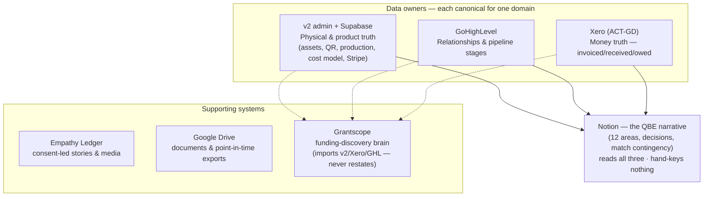

# Operating Systems — Source of Truth, Freshness & Map (QBE Area 6)

**Date:** 2026-05-30 · **Live version:** `/admin/operating-systems` (gated; freshness is live from Supabase).
**Purpose:** close most of QBE Area 6 (Process & Technology) — make the operating backbone explainable, document who owns which truth, and give a repeatable freshness check before any external claim.

**Governing principle:** data flows **one way** into each owner. Each system is the source of truth for exactly one domain and *reads* the others — it never restates them. (Restating is what produced the stale Centrecorp $208K vs the real $123,332.)

---

## 1. Operating-systems map

---

## 2. Source-of-truth matrix

| System | Source of truth for | Reads | Never the source of | Where it lives |
|---|---|---|---|---|
| **v2 admin + Supabase** | Assets (register + QR digital twins), production, cost model v6, public site + Stripe orders | Nothing — primary record | Funder relationships / money received | Supabase `cwsyhpiuepvdjtxaozwf` · `/admin` |
| **GoHighLevel (GHL)** | Every relationship + its pipeline stage (buyers, supporters, demand, capital) | Asset/demand signals from v2 | Dollars received — never sum money from cards | GHL location · `v2/src/lib/ghl` |
| **Xero (ACT-GD)** | All money invoiced, received, owed — the ONLY revenue source of truth | Nothing — financial record | Pipeline/forecast (that is GHL) | ACT-infra mirror `tednluwflfhxyucgwigh` (`xero_invoices`) |
| **Notion** | The QBE narrative (12 areas, decisions, the match contingency) | Numbers from v2, Xero, GHL | Any number — pulls from the three owners, never hand-keys | Notion · Goods. HQ |
| Empathy Ledger | Storyteller consent, stories, media assets | Goods project tag | Asset/financial counts | EL Supabase · project `goods` |
| Google Drive | Source docs, signed PDFs, CSV/xlsx exports | Generated reports from v2/Notion | Live data — holds point-in-time exports | Drive · Goods folders |
| Grantscope | Grant matching + readiness analysis | Xero, GHL, v2 demand | Asset/cost numbers — must import v2, not hard-code | grantscope repo · `goods-signals-workbench` |

---

## 3. Data-freshness checklist

Run before any external demo or funder claim. The live page shows current status from Supabase; thresholds are per-domain. Snapshot **as of 2026-05-30**:

| Status | Domain | Source (table.column) | Last updated | Stale after | Backs the claim |
|---|---|---|---|---|---|
| 🟢 Fresh | Asset register | `assets.created_time` | last batch ~14 May 2026 | 45d | "496 beds across 10 communities" |
| 🔴 Stale | CRM pipeline | `crm_deals.updated_at` | 27 Mar 2026 (~64d) | 14d | Buyer/funder pipeline status (never a $ figure) |
| 🔴 Stale | Production | `production_shifts.created_at` | 14 Mar 2026 (~77d) | 30d | Production capacity / "we are making beds" |
| 🟢 Fresh | Fleet telemetry | `usage_logs.created_at` | 29 May 2026 | 3d | Washing-machine usage/telemetry (pilot, not fleet-wide) |
| 🟢 Fresh | Commerce (orders) | `orders.created_at` | 25 May 2026 | 45d | Stripe shop / direct sales |

**Action implied by this snapshot:** before any QBE demo, **touch the CRM pipeline** (stale ~64d → reads as abandoned) and **log/annotate production** (stale ~77d → do not imply active production). Fleet, orders and the register are current.

---
*Source data + columns verified against the live v2 schema (curl + service role, 2026-05-30). Canonical figures: `wiki/outputs/2026-05-29-qbe-canonical-numbers-sheet.md`.*
