> Working map for reviewing the QBE/SIH diagnostic one area at a time, turning each area into simple workflows, investor-ready explanations, and human-verifiable evidence. This is an internal draft for founder review before copying into Notion or sending to SIH, QBE, funders, investors, or advisors.

# QBE Area Workflow Map

Date: 2026-05-31  
Status: internal working draft for founder review  
Scope: SIH/QBE diagnostic Areas 01 to 10, plus internal tools 11 and 12  
Primary use: review each area with Ben/Nic, explain where Goods is at, and decide what an investor can safely rely on.

## Verification Position

What was verified in this pass:

- The Notion database at `cb3794d427914d72bf1036106d8116f5` was fetched. It is titled `QBE Diagnostic Artifact Database` and has the expected area, priority, evidence, build status, claim label, proof, and next build fields.
- Notion search inside the database returned the 10 diagnostic area pages plus Area 11 Cost Model and supporting canonical-number material.
- The diagnostic PDF exists locally at `/Users/benknight/Downloads/ACT_GOC Impact Investment Diagnostic V4 130526.pdf`. `pdfinfo` confirms it is the 10-page report created 2026-05-13, and `pdftotext` confirms the six SIH recommendations and the 10-area diagnostic structure.
- Local wiki outputs for Areas 01 to 10 were reviewed as the working mirrors of the diagnostic build.
- The codebase drift guard has a live Supabase verification path through `v2/scripts/check-asset-drift.mjs`, using `.env.local` and the correct v2 project rather than Supabase MCP.

What is not fully verified here:

- The Notion table query tool still errors with `notion-query-data-sources not found`, so this pass used Notion fetch/search and local wiki mirrors rather than a full Notion table export.
- HighLevel returned `401: Reauthentication required`, so GHL pipeline facts must remain unverified until the connector is reauthenticated or pipeline data is checked another way.
- Xero was not queried live in this pass. Finance numbers should stay labelled as Xero workpaper, accountant review required, unless a fresh Xero query or accountant pack is attached.
- No Notion pages were mutated. This file is a local draft only.

## Core Rule

Every claim needs one of these labels:

| Label | Meaning | Can investors see it? |
|---|---|---|
| verified | Source-backed fact, with date and owner. | Yes, if the source can be shown. |
| workpaper | Pulled from an operating system or spreadsheet, but not independently reviewed. | Yes, with caveat. |
| modelled | Calculated from assumptions. | Yes, only with assumptions shown. |
| target | A planned next state with a plausible path. | Yes, if clearly framed as target. |
| future | Strategic intent, not yet operating. | Use carefully. |
| internal only | Useful for decisions but not suitable externally. | No. |
| needs review | Needs founder, legal, accountant, community, or advisor sign-off. | No, except as a stated gap. |

Plain investor line:

> Goods has real proof in the field. The QBE work is about turning that proof into paperwork investors can rely on: finance, governance, risk, legal structure, LOIs, and clean evidence labels.

## Master Workflow

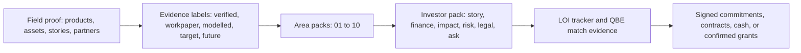

## Canonical Numbers To Protect

Use these unless a newer verified source replaces them:

| Claim | Current safe wording |
|---|---|
| Beds deployed | 496 deployed bed units in the asset register. |
| Stretch Bed units in deployed bed total | 133 Stretch Bed units, with 363 Basket Bed units. |
| Plastic diverted | 2,660kg, calculated from Stretch Bed units only at 20kg per bed. |
| Washing machines | 28 deployed, 14 working. |
| Communities served | 9 communities served. Do not use 10 for public/funder copy unless the metric is explicitly different. |
| Product source of truth | `v2/src/lib/data/products.ts`. |
| Checkout product | Stretch Bed only. Washing machines are register-interest. Basket Bed is open-source/download. |

## Area 01: Vision And Ambition

Human explanation: Goods knows why it exists. The gap is not the vision. The gap is making the operating model clear enough that someone who has never heard Ben or Nic explain it can understand how Goods, ACT, Butterfly, community partners, production, ownership, capital, and accountability fit together.

Where we are:

- SIH scored this as a strength: current 8, target 9.
- Strong verbal founder story exists.
- The written operating model still needs a simple diagram and founder-authored narrative.
- Community ownership must stay labelled as a pathway, not a current legal fact.

What good looks like:

- One founder-authored 1 to 3 page story.
- One operating model diagram showing Goods, ACT, Butterfly, community partners, funders, buyers, and future community entities.
- Clear wording for what is current, target, and future.

What to show investors:

- Stretch Bed as the anchor proof.
- Founder story.
- Operating model diagram.
- The sentence: "Goods is building a practical pathway from durable products into local repair, recycling, production, and ownership on Country."

Who verifies it:

- Ben and Nic for truth.
- Legal/governance advisor for entity and ownership language.

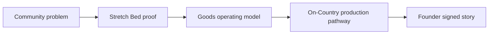

## Area 02: Social Objective And Impact

Human explanation: Goods has real impact evidence, but impact claims need labels. Some things are tracked now, some are modelled, some are targets, and some are future outcomes. Investors will trust the story more when the claim discipline is visible.

Where we are:

- SIH scored this as a priority gap: current 5, target 8.
- Theory of Change and MEL work is now much stronger than the diagnostic baseline.
- The open risk is public copy or dashboards implying every number is live or every outcome is measured.

What good looks like:

- A short Theory of Change graphic.
- Seven priority metrics.
- Every impact number labelled tracked, modelled, target, future, or internal only.
- Consent-cleared story examples.

What to show investors:

- Asset register proof.
- QR and reporting flow.
- A claim map with labels.
- The sentence: "We can show what we track today, what we model from assumptions, and what we are still building the evidence system to prove."

Who verifies it:

- Founder for claim truth.
- Community/data consent owner for story and media use.
- Impact advisor if health or wellbeing claims are included.

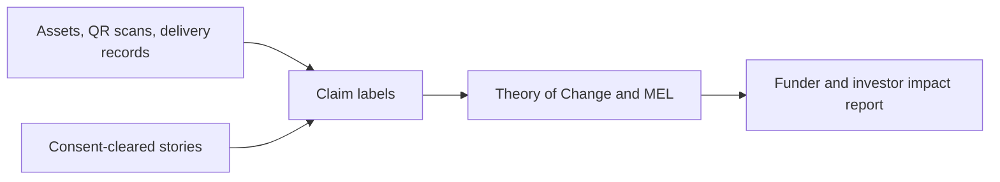

## Area 03: Business Model

Human explanation: Goods has a real product and real demand signals. The missing investor layer is not "does anyone want this?" It is a clear buyer model: who buys, who pays, how decisions are made, how orders become deliveries, and which conversations have become signed commitments.

Where we are:

- SIH scored this as a priority gap: current 4, target 7.
- Stretch Bed checkout and product proof exist.
- Cost model work exists.
- Market sizing and buyer segmentation still need to be made investor-grade.
- Warm pipeline must not be described as committed demand.

What good looks like:

- Four buyer lanes: institutional buyers, funders/grants, community partners, direct ecommerce.
- Buyer sheet for Stretch Bed.
- LOI tracker showing status ladder from target to cash received.
- QBE hackathon framed around market demand and procurement conversion.

What to show investors:

- Stretch Bed buyer sheet.
- Segment map.
- LOI tracker.
- The sentence: "The next commercial job is to turn warm demand into procurement-ready commitments, not to invent a market from scratch."

Who verifies it:

- Founder and BD/sales owner.
- GHL or CRM data owner after reauthentication.
- Legal for contracting party.

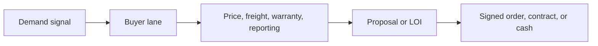

## Area 04: Financial Management

Human explanation: Goods has finance workpapers, cost models, and operating evidence. The gap is that investors need a Goods-only financial pack that has been reviewed by an accountant and separates facts, workpapers, assumptions, and scenarios.

Where we are:

- SIH scored this as a priority gap: current 4, target 7.
- Cost model and Xero workpaper evidence exist.
- Founder FTE cost, opening cash, ACT carve-out, receivables/payables, and 3-statement model need review.
- Xero figures should not be called audited accounts.

What good looks like:

- Goods-only 3-statement model.
- Unit economics and cost ladder.
- Founder FTE sensitivity.
- Cash runway and working capital scenarios.
- Accountant-reviewed summary.

What to show investors:

- Cost model with assumptions.
- Finance pack status.
- Use-of-funds bridge.
- The sentence: "We have built the workpapers. The next step is accountant review so the finance pack can carry repayable capital conversations."

Who verifies it:

- Accountant or fractional CFO.
- Founder for assumptions.
- Legal/entity owner for ACT/Goods carve-out.

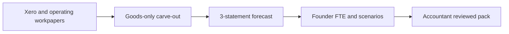

## Area 05: Strategic Planning And Risk

Human explanation: Goods is adaptive and practical. The investor gap is turning founder judgement into a risk system with owners, triggers, review cadence, and decisions about what happens if capital, supply, production, demand, or governance shifts.

Where we are:

- SIH scored this as a priority gap: current 5, target 7.
- Risk register v0.1 exists.
- Environmental, product, cultural/data, finance, legal, founder capacity, and pipeline risks are known.
- The register needs owner assignment and governance review.

What good looks like:

- Board-grade risk register.
- Scenario table.
- Review rhythm.
- Clear triggers for delayed capital, partial match, production issues, data/consent issues, and founder capacity.

What to show investors:

- Top 10 risk register.
- Scenario response table.
- The sentence: "The risks are real and named. We are not hiding them. The next phase gives them owners, triggers, and review discipline."

Who verifies it:

- Founder.
- Governance/advisory owner.
- Legal/accountant for legal and finance risks.

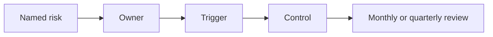

## Area 06: Process And Technology

Human explanation: Goods has more operating infrastructure than most early social enterprises: asset register, QR flows, reports, admin pages, product data, and wiki/Notion knowledge. The gap is not the absence of systems. The gap is ownership, freshness, and SOPs.

Where we are:

- SIH scored this as a relative strength: current 7, target 8.
- Admin and reporting surfaces exist.
- Asset and QR infrastructure exists.
- SOPs, owner map, and stale-data checks need to catch up.

What good looks like:

- Operating systems map.
- SOP index.
- Data freshness rules.
- Owner for each system.
- "Last checked" or "last refreshed" discipline for investor-facing numbers.

What to show investors:

- Asset/QR/reporting demo.
- SOP/source-of-truth matrix.
- The sentence: "Goods has a working operating backbone. We are turning it from founder-held infrastructure into a repeatable system with owners and freshness checks."

Who verifies it:

- Ops owner.
- Founder for source-of-truth rules.
- Data/reporting owner for stale-data checks.

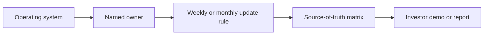

## Area 07: Governance, Data And Reporting

Human explanation: This is the red area. Goods has advisory support, founder accountability, data-sovereignty practice, and reporting tools, but it does not yet have a formal governance system investors can rely on for capital, conflict management, delegations, reporting, and data controls.

Where we are:

- SIH scored this as a priority gap: current 5, target 8.
- Advisory support exists but is not a formal board.
- Butterfly transition work exists but is not complete.
- Data sovereignty principles exist and need operational rules.
- Reporting exists but needs cadence and authority.

What good looks like:

- Governance map: who advises, who decides, who reports.
- Advisory terms of reference.
- Skills matrix.
- Conflicts and delegations register.
- Reporting calendar.
- Data sovereignty and consent one-pager.

What to show investors:

- Current governance map.
- Reporting calendar.
- Data consent rules.
- The sentence: "We are not pretending advisory support is a board. The next phase formalises who advises, who decides, and what gets reported."

Who verifies it:

- Founder.
- Governance/legal advisor.
- Board/advisory members if named.
- Community/data consent owner for story and data rules.

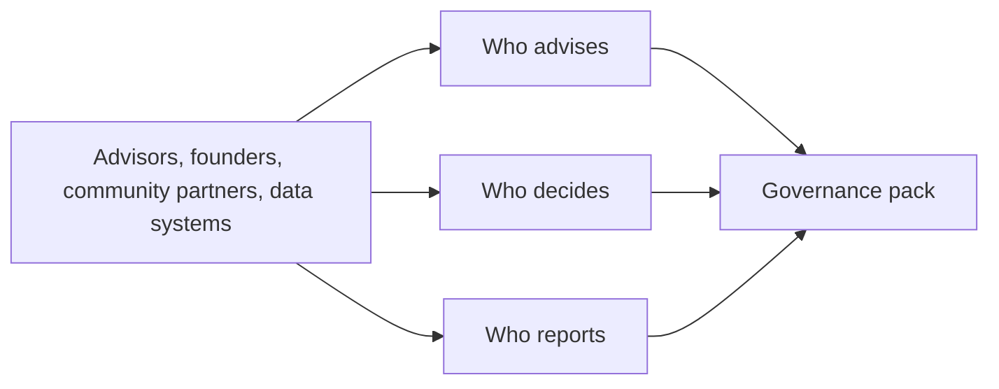

## Area 08: People And Organisation

Human explanation: Goods has proven a lot with a very lean team. That is strength and risk at the same time. The next stage should not create a heavy head office. It should move repeatable work off Ben and Nic into clear roles.

Where we are:

- SIH scored this as current 6, target 7.
- Ben and Nic carry too much of the system.
- Priority roles are GM/ops, BD/sales-ops/procurement, production lead/trainer, finance support, and community/data consent coordination.
- Founder FTE costing is needed for the finance model.

What good looks like:

- Now/next org chart.
- Founder capacity risk note.
- Costed role sequence.
- 90-day delegation plan.

What to show investors:

- Lean current team.
- Capacity risk and role plan.
- The sentence: "We have proved the model lean. The next stage funds the roles that turn founder intensity into a reliable operating system."

Who verifies it:

- Founder.
- Finance/accountant for FTE costing.
- Governance owner for role authority and reporting lines.

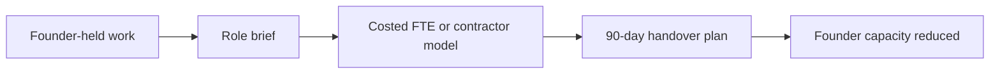

## Area 09: Legal Structure

Human explanation: The legal structure needs to carry three jobs: trading and product risk, charitable/public-benefit funding, and future community-controlled production. The entities and pathway are clearer now, but they need to be papered before investors rely on them.

Where we are:

- SIH scored this as current 5, target 7.
- Current operating entity and go-forward company pathway have been identified in the area review.
- Butterfly is the DGR pathway from FY2026-27, subject to handover and safeguards.
- Community production entities remain future/target.
- Contracting party, IP, licence, benefit-share, and mission protection need legal review.

What good looks like:

- One-page legal/entity map.
- Contracting-party checklist.
- IP register.
- DGR/Butterfly transition caveats.
- Community ownership trigger points.

What to show investors:

- Current legal reality, not aspiration.
- Legal workplan.
- The sentence: "The structure is being designed to carry trading, public-benefit funding, and future community production without pretending those steps are already complete."

Who verifies it:

- Lawyer.
- Founder.
- Accountant for related-party and fund flow implications.

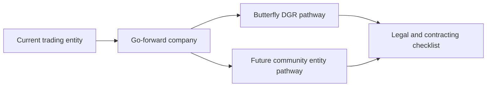

## Area 10: Investors And Capital Raising

Human explanation: Area 10 is the spine. It pulls together all other areas into a pack an investor can use: story, product, impact, buyer proof, finance, risk, operations, governance, people, legal, and a specific ask. The gap is not the absence of proof. It is investor-grade evidence control.

Where we are:

- SIH scored this as current 6, target 8.
- Investor-relevant proof exists across product, assets, admin, reports, cost model, and QBE pathway.
- No signed QBE-matching LOIs were verified in the current materials.
- GHL pipeline needs reauthentication or alternate verification.
- Active pipeline must not be counted as committed capital.

What good looks like:

- Founder-authored investor pack.
- QBE matched-funding evidence checklist.
- LOI tracker.
- Use-of-funds budget by tranche.
- Investor FAQ with safe answers.

What to show investors:

- Area 10 pack modules.
- LOI tracker.
- Use-of-funds.
- The sentence: "We have strong field and operating proof. We are now converting it into signed commitments, clean evidence, and a finance/governance pack suitable for capital."

Who verifies it:

- Founder.
- Finance/accountant.
- Legal/governance advisor.
- CRM/GHL owner for pipeline status.
- QBE/SIH for match rules.

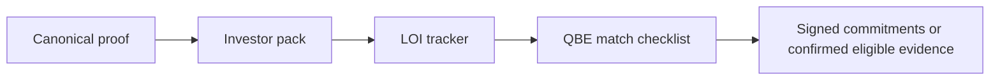

## Area 11: Cost Model V6 (Internal Tool)

Human explanation: This is not one of SIH's 10 scored areas. It is an internal tool that helps answer Areas 03 and 04: what does a bed cost now, what could it cost at scale, what assumptions matter, and how sensitive is the business to material, labour, freight, batch size, and production pathway.

Where we are:

- Cost model work exists and supports the SIH advisory.
- It should feed the Goods-only finance model and the Matt Allen/SIH cost-tool workstream.
- It remains a model, not audited fact.

What good looks like:

- Bill of materials.
- Current low-volume cost.
- Factory/direct path.
- Scale sensitivity.
- Scenario summary suitable for SIH, accountant, and investors.

What to show investors:

- Only the summary, assumptions, and sensitivity ranges.
- The sentence: "The model shows which costs matter most and where scale or On-Country production could change the economics."
- Real tool: `https://www.goodsoncountry.com/investors` for the password-gated investor cockpit.
- Slider views: `https://www.goodsoncountry.com/investors?skin=mc`, `https://www.goodsoncountry.com/investors?skin=tesla`, and `https://www.goodsoncountry.com/investors?skin=terminal`.
- Admin source route: `https://www.goodsoncountry.com/admin/cost-model`.
- Current code-verified values: Buy-Kit marginal AUD 684.79, Factory marginal AUD 425.74, Community marginal AUD 420.74, annual fixed block AUD 109,500, Factory breakeven 338, Community breakeven 333, gross capex AUD 112,000 to 222,000, net capex AUD 1,954 to 111,954.

Who verifies it:

- Founder/product owner.
- Accountant/finance reviewer.
- SIH cost advisor.

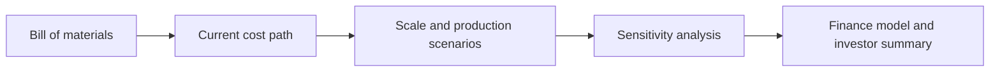

## Area 12: Investor Alignment Tool (Internal Tool)

Human explanation: This is also not one of SIH's 10 scored areas. It is a discipline tool so Goods does not chase every funder or investor. It should rank fit, evidence needed, current status, next action, and whether the capital type is healthy for the mission.

Where we are:

- Investor universe and alignment thinking exists.
- The missing operating layer is a live tracker connected to LOIs, QBE match evidence, and safe external wording.
- GHL could support follow-up once reauthenticated, but GHL should not become the source of truth for impact, story, or legal claims.

What good looks like:

- Investor/funder target list.
- Fit score.
- Status ladder.
- Evidence needed.
- Next action and owner.
- Safe external sentence for each relationship.

What to show investors:

- Not the whole internal scoring sheet.
- Use it to decide who gets which pack and what the next ask is.
- The sentence: "We are matching capital to the job it should do: grants and philanthropy for setup and community capacity, patient working capital for confirmed demand, and later community-aligned ownership only when the structure is ready."

Who verifies it:

- Founder.
- BD/investor lead.
- Finance/legal/governance for capital suitability.

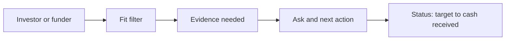

## Investor Meeting Flow

Use this flow when explaining the whole story to someone new:

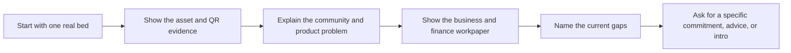

Simple talk track:

1. Goods started with a practical product problem: mainstream goods fail in remote conditions.
2. The Stretch Bed is the flagship proof: durable, washable, repairable, flat-packable, and tracked.
3. The impact story is real, but we label what is tracked, modelled, target, and future.
4. The main gap is now paperwork and operating maturity: finance, governance, legal, risk, people, and signed commitments.
5. QBE Stage 2 depends on matched evidence. Warm conversations are not enough.
6. The ask to investors is specific: help convert proof into signed commitments, fit-for-purpose capital, and capacity that reduces founder bottleneck.

## What Not To Say

- Do not say 10 communities served in public/funder copy. Use 9 communities served unless a different metric is explicitly named.
- Do not say the QBE match is secured.
- Do not count active pipeline as committed capital.
- Do not call Xero workpapers audited financials.
- Do not say Goods or A Curious Tractor has DGR status. DGR is a Butterfly pathway from FY2026-27 and still needs safeguards.
- Do not say community ownership is complete.
- Do not say On-Country production is operating permanently unless tied to a specific active site and batch.
- Do not say all beds diverted plastic. Plastic impact is Stretch Bed only.
- Do not show raw story, household, QR, health, support, or contact data externally without consent and purpose.

## One-By-One Review Method

For each area, use the same four questions:

1. Truth: what can Ben and Nic personally stand behind in live Q&A?
2. Evidence: what source proves it, and what label does the claim need?
3. Investor use: what would an investor need before relying on it?
4. Next action: who owns the next artifact, by when, and what could block it?

Recommended review order:

| Session | Area | Why first |
|---|---|---|
| 1 | 10 Investors | Sets the spine and shows which evidence each investor pack module needs. |
| 2 | 04 Finance | Blocks repayable capital and SIH cost advisory. |
| 3 | 07 Governance | The reddest gap and highest trust risk. |
| 4 | 03 Business Model | Connects QBE hackathon, market sizing, buyer lanes, and LOIs. |
| 5 | 02 Impact | Important, now mostly improved, but needs claim labels. |
| 6 | 09 Legal | Protects DGR, contracting party, IP, and community ownership claims. |
| 7 | 08 People | Converts founder bottleneck into costed role sequence. |
| 8 | 05 Risk | Gives every known risk an owner and trigger. |
| 9 | 06 Process/Tech | Makes the admin stack investor-demo ready. |
| 10 | 01 Vision | Final founder story and operating model once the caveats are clean. |
| 11 | 11 Cost Model | Internal finance and SIH advisory support. |
| 12 | 12 Investor Alignment | Internal targeting and follow-up discipline. |

## Immediate Artifacts To Build

| Artifact | Supports areas | Current status | Owner to confirm |
|---|---|---|---|
| Founder-authored investor pack | 01 to 10 | Needs founder draft from area work. | Ben/Nic |
| LOI tracker | 03, 05, 08, 10, 12 | Designed, not yet verified live in GHL. | BD/investor lead |
| QBE match checklist | 04, 05, 07, 09, 10 | Needs QBE/SIH rule confirmation. | Ben/Nic + SIH/QBE |
| Goods-only financial model | 04, 08, 11 | Partial. Needs accountant review and FTE assumptions. | Finance/accountant |
| Governance map and reporting calendar | 07 | Draft exists. Needs formal owner/review. | Governance owner |
| Legal/entity map and contracting checklist | 09 | Draft exists. Needs legal review. | Lawyer/founder |
| Impact claim map with labels | 02, 06, 07 | Draft exists. Needs public surface cleanup. | Founder + data owner |
| Buyer segment map and buyer sheet | 03, 10 | Partial. Needs market sizing and safe claims. | BD/founder |

## Source Trail

- Notion database: `QBE Diagnostic Artifact Database`, `cb3794d427914d72bf1036106d8116f5`.
- Local diagnostic PDF: `/Users/benknight/Downloads/ACT_GOC Impact Investment Diagnostic V4 130526.pdf`.
- Local area reviews:
  - `wiki/outputs/2026-05-28-qbe-area-01-vision-full-review.md`
  - `wiki/outputs/2026-05-28-qbe-area-02-impact-full-review.md`
  - `wiki/outputs/2026-05-28-qbe-area-03-business-model-full-review.md`
  - `wiki/outputs/2026-05-29-qbe-area-04-financial-management-full-review.md`
  - `wiki/outputs/2026-05-29-qbe-area-05-strategic-planning-risk-full-review.md`
  - `wiki/outputs/2026-05-29-qbe-area-06-process-technology-full-review.md`
  - `wiki/outputs/2026-05-29-qbe-area-07-governance-data-reporting-full-review.md`
  - `wiki/outputs/2026-05-29-qbe-area-08-people-organisation-full-review.md`
  - `wiki/outputs/2026-05-29-qbe-area-09-legal-structure-full-review.md`
  - `wiki/outputs/2026-05-29-qbe-area-10-investors-capital-raising-full-review.md`
- Cross-area synthesis: `wiki/outputs/2026-05-29-qbe-cross-area-alignment-review.md`.
- Diagnostic vs now alignment: `wiki/outputs/2026-05-30-qbe-diagnostic-vs-now-alignment.md`.
- Canonical product source: `v2/src/lib/data/products.ts`.
- Canonical asset source and drift guard: `v2/src/lib/data/asset-canonical.ts`, `v2/scripts/check-asset-drift.mjs`, `v2/scripts/check-community-copy.mjs`.
