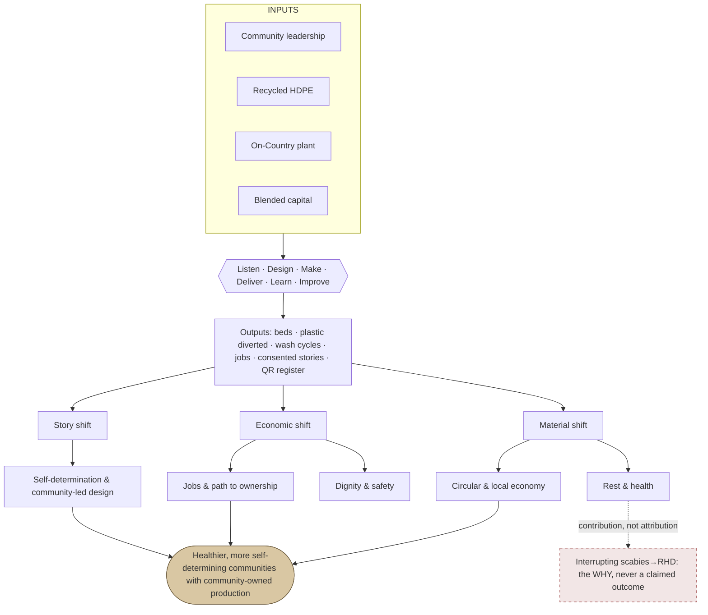
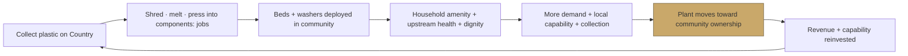
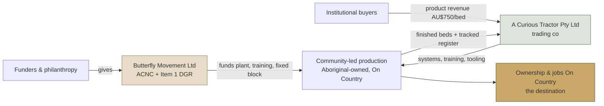
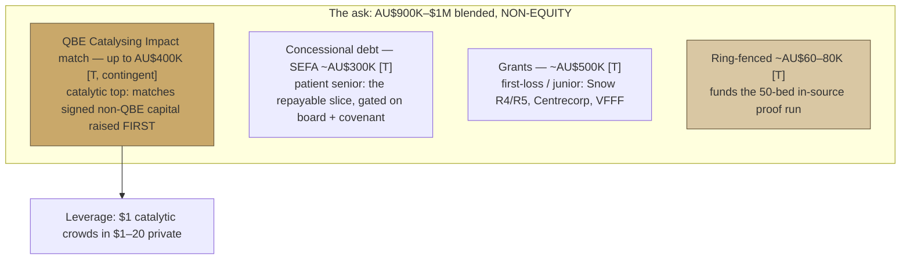
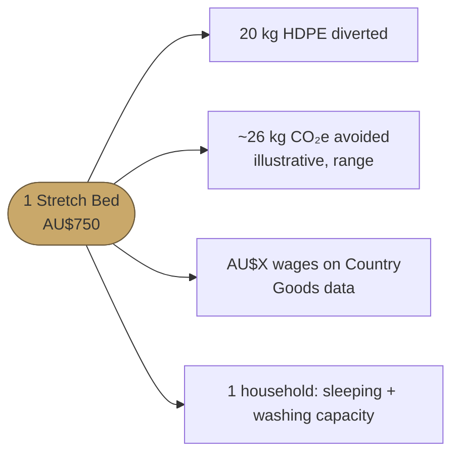

# Goods on Country — Investment Deck Alignment

> CANON NOTE (2026-07-20): figures in this dated doc predate the final canon (540 beds / 177 Stretch / 22 washers / 11 communities / 3,540kg). Do not copy numbers from here; use canon.ts.

**Generated:** 2026-07-17 · **Purpose:** align the Goods investment deck to external best practice, build out the impact model, plan the diagrams, and set a co-create process. **Method:** five parallel research streams (two external: pitch-deck best practice + impact-model/data-viz frameworks; three internal: existing deck system, impact model + financials, investor/capital/product truth) synthesised against the canonical assets, the 2026-05-30 world's-best-deck blueprint, and the real Snow Foundation feedback.

> **House rules honoured in this doc:** canon numbers only (`asset-canonical.ts`), the claim ceiling (scabies→RHD is the *why*, never a claimed outcome), ownership is a *pathway*, no "co-design", no charity framing, no em dashes in example copy. Where figures conflict across the repo, the conflict is flagged, not silently resolved.

---

## 0. TL;DR — the one thing, then five moves

**The one thing (unchanged from the blueprint, and it is right):** the deck's job is to convert the warmest existing funders (Snow, Centrecorp, SEFA) into the **first ~AU$400K of signed, match-eligible capital before 31 August 2026**, because the QBE Catalysing Impact match (up to AU$400K) is an *output* of money raised first. Everything else serves that.

**What is already excellent:** the live story deck (`deck.ts`, updated 15 July 2026) is best-in-class on narrative. One loop, six belief-turns each carried by a named consent-cleared voice, a "truck-test" hinge, ask once and last. The impact model (canonical 2026-06-18) is disciplined and honest. Do not rebuild these.

**The five alignment moves this doc delivers:**

| # | Move | Why (best-practice basis) | Section |
|---|------|---------------------------|---------|
| 1 | Merge the **investor-mechanics layer** into the narrative spine | Investors dwell longest on Team + Financials; the live deck has neither | §3 |
| 2 | Add a **risk & mitigation** slide + name Do-No-Harm and dynamic consent | Snow asked for this explicitly; impact investors treat Risk as an impact dimension | §6 |
| 3 | Build the **impact model** out with IMP five-dimensions + ABC + a logic model behind the ToC | It is the shared vocabulary impact investors expect | §4 |
| 4 | Turn the **diagram** work into a plan: inventory the 15 existing visuals, map to slides, fill gaps | You already own a strong visual suite; align not reinvent | §5 |
| 5 | Run a **co-create process** using the deck-builder + narrative-lab + consent gates | Sovereignty as a system is your differentiator; the process must model it | §7 |

**The honest verdict to design against** (from your own adversarial critique, and it still holds): *strong proof, unproven economics, unsigned money.* The deck wins by showing the gaps, not papering over them.

---

## 1. What "aligned" means — the external benchmarks

Sources are listed in the Appendix. Key evidence on how investors actually read a deck:

- **They read fast.** Average time on a first read is **3 min 44 sec** across a deck of **~19 pages**; seed investors spend closer to **~2 min** (DocSend, 200 startups / US$360M raised). If a single slide takes more than ~30 seconds to parse, it is too complex.
- **The first three slides are a filter.** Cover, problem, solution decide whether the rest is read. Time-on-deck correlates with getting the meeting.
- **They dwell on Team and Financials**, and skim the product slide (images parse faster than text). This is the single biggest gap in the current Goods deck.
- **Boring beats beautiful at this stage.** Y Combinator's three principles are *legibility, simplicity, obviousness*; "visually stunning slides often hurt seed-stage pitches." Kawasaki's 10/20/30: ten slides, twenty minutes, nothing under 30pt.

**What an impact / blended-finance deck does differently** (this is where Goods must diverge from a pure-commercial template):

1. **Impact and return live on the same page**, never quarantined in an appendix. Every slide argues both sides of the blended-value equation.
2. **A Theory of Change replaces hand-waving.** The causal chain (inputs → activities → outputs → outcomes → impact) lets an investor see causality and pick indicators.
3. **A shared measurement vocabulary is expected.** The **Impact Management Project five dimensions** (What, Who, How Much, Contribution, Risk) and the **ABC classification** (Act to avoid harm / Benefit / Contribute to solutions). Goods is a clear **"C — Contribute to solutions"**. Naming your ABC position and five dimensions signals fluency.
4. **The ask is a capital stack, not a number.** Catalytic capital accepts lower/slower/riskier returns to *crowd in* commercial money. The documented leverage is roughly **$1 catalytic → $1–20 private** (HBS), and ~**$4 private per $1 concessional** in blended structures. Show the tranches and what each de-risks.
5. **Risk is an impact dimension.** Impact investors want the likelihood impact under-delivers, and your mitigations. Naming impact-risk honestly builds more credibility than a flawless story.

**The Indigenous-enterprise trust layer** (slides a commercial deck never needs, and where Goods earns trust):

- **Community ownership as a pathway**, framed as "moving closer to", never complete. This is your mission-lock and the reason concessional capital belongs here.
- **Data sovereignty as infrastructure**, not a footnote. CARE principles and the Maiam nayri Wingara Indigenous Data Sovereignty principles: community holds authority over its own data and the right to recall a story. You already run this as a code-enforced consent gate; most ventures cannot say that.
- **The economic-value framing:** every $1 of Indigenous-business revenue generates **$4.41** of economic and social value (Supply Nation, via First Australians Capital). Lead with impact-as-value, never charity.

**The distilled do / don't list** (full version in R1 research):

| Do | Don't |
|----|-------|
| Keep to ~10–15 core slides, each <30s to parse; depth in an appendix | Overload slides; make the investor work too hard |
| Over-invest in Team and Financials | Claim "no competitors" (reads as naïve) |
| Put the financial number on the same slide as the impact claim | Show a hockey stick with no basis |
| One Theory-of-Change diagram; label IMP five-dimensions / ABC | Forget the ask (a common, costly omission) |
| Show the capital stack and its leverage | Hide behind jargon, including impact jargon |
| Quantify credible traction (deployments, revenue, pipeline) | Treat impact as charity or as a returns trade-off |
| Make community ownership and data governance explicit | Over-design at seed stage |
| State the ask precisely: amount, instruments, milestones, use of funds | Bury the honest gaps (they surface in diligence) |

---

## 2. Where Goods stands today — the honest gap analysis

You do not have one deck. You have **five parallel surfaces**, with no single canonical ask or number set flowing between them:

| Surface | Where | Character | State |
|---------|-------|-----------|-------|
| **Story deck** (the main one) | `deck.ts` → `/pitch/deck` + `/admin/deck-builder` | 10 slides, narrative-led, named voices, ask once and last | Live, updated **15 July 2026**. Best asset. |
| Investment memo | `/pitch/document` | 9 pages, has a Risks section | Live, older number set |
| Marketing pitch | `/pitch` | 11 sections, hand-built | Live, older number set |
| Funder-report renderer | `/admin/deck` | Markdown → print/PDF; defaults to Centrecorp deck | Live, delivery-report not raise |
| Narrative-lab | `investor-narrative-lab.ts`, `pitch-workshop.ts`, `pitch-photo-review.ts` | Audience/angle libraries (routes × lenses × places × photos) | **Orphaned** — rendered by nothing, dead links |
| Best-practice blueprint | `2026-05-30-...blueprint.md` | 16 slides, adversarially critiqued | Wiki doc, **un-wired**, 7 weeks stale |

**The core finding:** the **narrative layer is best-in-class and honestly governed**; the **investor-mechanics layer** (unit economics, team/org, governance/entity, use-of-funds, why-now, round-status, risk/mitigation) exists only in the un-wired blueprint and scattered across `/pitch/document`. It has never been merged into the live spine.

The live `deck.ts` has exactly **one financial chip (revenue) and one ask chip ($400K)**. The blueprint's Slides 7–15 and its critique call the missing six slides *gating essentials* for catalytic capital.

**The adversarial investor verdict (still the binding constraint):**

> "Strong proof, unproven economics, unsigned money. A genuinely fundable mission that is one signed term sheet and one production run away from yes."

Three things that define an *investable* enterprise did not yet exist at the blueprint date: a single signed dollar to catalyse, a single measured in-source unit cost, and a fiduciary board. **Current state has moved (verify before the deck ships):**

- Snow R4 **AU$132K appears AUTHORISED** (INV-0321) per the financial model — this may already be the "first signed dollar" the blueprint said was missing. Confirm.
- `deck.ts` now shows revenue **AU$713,827 labelled "accountant-signed carve-out"** — the accountant endorsement (a gating item) may be done or near-done. Confirm.
- The 50-bed in-source run (to turn the cost-down from modelled to measured) and the independent-majority board remain the open gates unless recently closed.

**Snow's own feedback is only partially built in.** Sally Grimsley-Ballard (Head of Partnerships, Snow Foundation) asked, verbatim, for four things the deck must answer:

1. Flesh out **risks and mitigations** — specifically **waste, demand for the plant, "payment first", key learnings**.
2. **Remove the Deadly Heart Trek reference**; carry the **Do No Harm** principle elsewhere.
3. Name **dynamic consent** explicitly.
4. Consider **Minderoo** and a list of other funders (SEDI, SELF, Giant Leap, Circular Future Fund, First Nations Business Acceleration, NTRAI).

Only `/pitch/document` has a risk section today. The main deck has no risk surface at all. §6 fixes this.

**Number inconsistencies to reconcile** (a diligence and trust risk — a sharp investor will find them):

- **Communities:** 9 (`deck.ts`, framework) vs 10 (blueprint) vs "Eight" (older brand-comms). Lock **9 served / 10 distinct**.
- **Revenue received:** AU$713,827 (`deck.ts`, accountant-signed) vs AU$741,111 (compendium canonical) vs AU$649,710.79 (blueprint). Lock **one accountant-signed figure**; for external use prefer the accountant-signed AU$713,827 and retire the rest.
- **Plastic per bed:** 25kg (old Snow pitch) vs **20kg canonical**. Fix.
- **Bed assembly:** "legs click on / slot on" (legacy surfaces) vs **X-trestle tension** (canonical, `products.ts`). Fix.
- **"Co-design"** appears across the Snow pitch and legacy surfaces; `deck.ts` correctly avoids it. Fix the legacy surfaces.

Full data-integrity list in §8.

---

## 3. The recommended deck architecture

**Principle: one canonical deck, built on the `deck.ts` narrative spine, with the blueprint's investor-mechanics slides merged in, sequenced to the external best-practice arc, and answering Snow.** Then retire or re-point the other four surfaces at the same data.

Target **15 core slides + appendix**. Each slide below shows its job, the Goods content, the best-practice basis, and the existing asset to use. Status labels ride on every number: **[V]** verified · **[W]** Xero workpaper, unaudited · **[M]** modelled · **[T]** target/sought.

| # | Slide | Job | Goods content | Best-practice basis | Existing asset |
|---|-------|-----|---------------|---------------------|----------------|
| 1 | **Click it yourself** | Cover + proof filter | "496 beds sleeping in 9 communities tonight, and you can click any one." Live register URL + QR | First of the 3-slide filter; open with verifiable proof | `deck.ts` cover; `/admin/assets` |
| 2 | **One bed, one name** | The human | Ray Nelson, bed GB0-156-96, digital-twin screenshot, one approved quote | Open on pain made human; community as hero | `deck.ts` turn-1; Utopia photos |
| 3 | **The problem** | Real, large, unsolved | Floor-sleeping + failed goods; the scabies→RHD *why*; "$3M/yr of washing machines dumped"; FRRR 2022: 59% of remote homes have no washing machine | Problem quantified in human + commercial terms | `07-slide-deck.md` stats |
| 4 | **Why now** | Urgency | Four clocks: QBE match deadline 31 Aug; proof at its freshest; free QBE expertise live; funders watching each other | Sequoia's most under-used slide | Blueprint Slide 13 |
| 5 | **The product** | How it works | Stretch Bed: recycled-HDPE X-trestle + steel poles + structural canvas; 26kg, 200kg, ~5min no tools, 10+yr; Pakkimjalki Kari washer | Keep visual; investors parse product from images | `deck.ts` turn-3; `goods-anatomy-bed.pdf` |
| 6 | **Impact thesis + Theory of Change** ★ | The spine | The hero ToC: 5 domains, 3 shifts, dotted contribution arrow to RHD, claim ceiling on the slide | The conceptual spine tying problem → solution → metrics | `theory-of-change.pdf` (refine per §5) |
| 7 | **Already shipped, honestly split** | Traction | **133 Stretch (flagship) + 363 Basket (legacy) = 496**, 9 communities, 2,660kg (Stretch only) [V]. Live register inset | Quantify traction; split not blend | Blueprint Slide 4; canonical rollup |
| 8 | **How we deliver** | Method is the proof | Utopia: 87 beds in 2 days, GPS + QR photo-log, council partnership; consent-led, not a donation drop | Operational capability de-risks scaling | Centrecorp deck; Utopia trip report |
| 9 | **Voice + data sovereignty** ★ | Sovereignty as a system | 12 consented Empathy Ledger stories, code-enforced recall right, CARE / Maiam nayri Wingara | Indigenous-enterprise trust slide | `deck.ts` voices; consent gate |
| 10 | **Unit economics, at today's real cost** ★ | Honest economics | Price AU$750 [V]; marginal cost AU$684.79 today [W]; breakeven **1,679/yr at today's cost**, falling to **333–338** after the cost-down; ~130 Stretch/yr now | Financials: investors dwell here; lead with the honest number | `goods-where-750-goes.pdf`, `goods-breakeven.pdf` |
| 11 | **The hypothesis this capital tests** ★ | The de-risking bet | 8.6x "idiot index" on plastic legs is **[V] real**; in-sourcing *could* roughly halve cost to AU$425.74 (factory) but is **[M], 0 beds assembled**; ~AU$60–80K funds a 50-bed run to prove it. Kill-criterion on the slide | Catalytic investors fund de-risking experiments with a stop-loss | `goods-idiot-index.pdf`, `goods-cost-down.pdf` |
| 12 | **Funding is grants, not yet revenue** | Honest composition | AU$713,827 received [W, accountant-signed], ~89% grant by design; commercial revenue is pre-traction; the raise builds the first commercial dollar | Don't imply revenue diversification you don't have | `goods-sankey-money.pdf` |
| 13 | **The model, and the gap is the ask** ★ | Solvency honesty | Two curves: un-injected trough vs injected result. "Balances" = accounting identity, not solvency. The gap between the curves = this raise | Show the un-injected curve; the gap is self-evidently the ask | `goods-scenarios.pdf`; 36-mo cashflow |
| 14 | **Team + who runs it** | Execution capacity | Who runs production/delivery/admin today (founders + Oonchiumpa) + the two hires the diagnostic flags (GM + BD) and what each unlocks | The slide investors dwell on; a raise with no team slide is a knockout | **Net-new — Ben supplies named roles** |
| 15 | **Structure protects the mission** ★ | Mission-lock + governance | Two capital streams (Butterfly DGR + trading co) → community ownership; non-equity by design; near-term ownership milestone with a date; governance + DGR gaps named openly | Community ownership as a dated trajectory, not a slogan | `operating-model.pdf` |
| 16 | **The precise, sequenced ask** ★ | Close | AU$900K–$1M blended non-equity; live ask = first ~AU$400K signed by 31 Aug; use-of-funds table with $ per bucket; what the first dollar buys | Name size + instruments + milestones + use of funds | Blueprint Slide 15 |
| 17 | **Be the first signed commitment** | Call to action | "Don't fund a charity and don't match nothing. Be the first signed dollar that proves the cost-down and releases two." Bookend Ray Nelson | End on vision + explicit CTA | `deck.ts` closing |

**Appendix (sent, not presented):** full impact metrics + measurement method, three-scenario financial model, product specs/warranty, the full risk register, the capital-stack detail, references.

**Audience variants (one spine, tuned open + ask).** Your orphaned `investor-narrative-lab.ts` already encodes five investor lenses and five narrative routes. Wire that thinking into the deck-builder as reorderable openings rather than five separate decks:

| Audience | Lead lens (route) | Opening move | Ask emphasis |
|----------|-------------------|--------------|--------------|
| Catalytic capital (QBE, PFI, Minderoo) | First proof of transfer | The de-risking experiment (Slide 11) | The match multiplier; be the first signed dollar |
| Impact investors / CDFI (SEFA, First Australians Capital) | Health hardware that works | Unit economics + repayability (Slides 10, 13) | Concessional debt tranche, revenue covenant |
| Foundations (Snow, TFN, VFFF, Tim Fairfax) | Place-owned production pathway | The human + community ownership (Slides 2, 15) | Grant, first-loss, restricted to place |
| Procurement buyers (councils, health, NDIS) | Health hardware / dignity | Problem + delivery method (Slides 3, 8) | Purchase order, not investment |
| Corporate / RAP | Plastic becomes useful on Country | The circular flywheel + jobs | Sponsorship + procurement + reconciliation |

---

## 4. Build the impact model

Your canonical model (2026-06-18) is strong and does not need replacing. What follows **overlays the impact-investor frameworks on top of it** so the deck speaks the standard, and fills the two gaps a diligence call will probe: the **logic model behind the ToC**, and the **IMP five-dimensions scoring**.

### 4.1 The spine you already have (keep it)

Every impact claim travels three steps on the same beat: a **voice** (the felt change, in their words) + a canon **number** (the scale) + an honest **label** (verified / modelled / future). Never a statistic alone, never a quote alone.

- **Three shifts** (the elevator version): **Material** (waste plastic becomes durable washable goods made On Country), **Economic** (built to beat the true remote cost; value and jobs stay local; grant-funded → community-owned), **Story** (communities name it, design it, own the record of it — Indigenous self-determination).
- **Five outcome domains** (the backbone): Rest & health · Dignity & safety · Indigenous self-determination & community-led design · Jobs, On Country work & the path to ownership · Circular & local economy.
- **The claim ceiling (absolute):** scabies→RHD is the *why*. A bed is health hardware, not a claimed health outcome. A health or justice outcome only leaves the "future" column when a partner clinical method (Miwatj and equivalent ACCHOs) produces it, attributed to that partner.

### 4.2 The overlay: name your ABC position and five dimensions (new — put a small table on the deck)

Goods is **ABC = "C — Contribute to solutions"** (the product actively contributes to a positive outcome for underserved people and planet). Score the five dimensions honestly:

| IMP dimension | Goods answer | Label |
|---------------|--------------|-------|
| **What** | Off-the-ground washable sleep + washing capacity + on-Country jobs + plastic diverted; outcomes that matter deeply to remote communities and are under-served | [V] outputs / [M] outcomes |
| **Who** | Aboriginal & Torres Strait Islander people in remote communities (9 served); among the most under-served, highest-RHD-burden populations in the world | [V] |
| **How much** | Scale: 133 Stretch + 16 washers, 9 communities. Depth: household amenity + dignity. Duration: 10+ yr design life | [V] scale / [T] depth+duration |
| **Contribution** | One upstream input into a systemic outcome. "Likely better than what would have occurred otherwise" given the remote-goods market failure. Never sole author of a health result | [M], framed as contribution |
| **Risk** | Impact risks named on the deck: execution, evidence (thin sample), unproven cost-down, demand-for-plant, consent/harm. Mitigations in §6 | [V] disclosed |

This one slide tells an impact investor you speak their language. It also *contains* the claim ceiling: the Contribution row is where you say, out loud, that you contribute to the RHD system rather than claim to move it.

### 4.3 The logic model behind the ToC (new — this is the operational table for the appendix)

The ToC is the story (why, backward from impact). The logic model is the metrics table behind it. Build the ToC first, derive this:

| Inputs | Activities | Outputs | Outcomes | Impact |
|--------|-----------|---------|----------|--------|
| Community leadership; recycled HDPE; steel + canvas; On-Country plant; blended capital; health + delivery partners | Listen · Design in community · Make on Country · Deliver & track · Learn · Improve (the loop, run twice) | Beds delivered [V]; plastic diverted [M]; wash cycles [V]; employment hours [M]; consent-led stories [V]; QR register [V] | **5 domains:** rest & health; dignity & safety; self-determination; jobs & ownership; circular economy | Healthier, more self-determining communities with locally-owned production and a circular economy that keeps value On Country |

### 4.4 Headline metrics per domain (mapped to IRIS+, with honest labels and targets)

Use recognised IRIS+ metric families so investors see a standard taxonomy, not invented KPIs. Current → Yr1 → Yr3 → Vision 2030, from `impact-model.ts`:

| Domain | Headline metric | Label | Current | Yr1 / Yr3 / 2030 |
|--------|-----------------|-------|--------:|------------------|
| Rest & health | Beds delivered | [V] | 496 | 1,500 / 5,000 / 25,000 |
| Rest & health | Wash cycles enabled | [V] | live | 15,000 / 60,000 / 500,000 |
| Dignity & safety | Communities served | [V] | 9 | 12 / 25 / 60 |
| Self-determination | Active storytellers (consented) | [V] | live | 50 / 100 / 300 |
| Jobs & ownership | FTE jobs on Country | [V] | 2 | 6 / 18 / 50 |
| Jobs & ownership | Employment hours | [M] 6.5/bed | live | 9,750 / 32,500 / 162,500 |
| Jobs & ownership | Community-owned production days/wk | [T] | 0 | 1 / 2 / 3 |
| Circular economy | HDPE diverted (kg) | [M] 20/bed | 2,660 | 30,000 / 125,000 / 500,000 |
| Economics through-line | Cost per bed | [M] | $534.79 | $275 / $200 / $271 |

**Do not put on the deck as an outcome:** any RHD reduction, government-savings number, sleep-nights proxy, or bed-to-courtroom justice claim. These were deliberately deleted from the model for breaching the claim ceiling. Keep them in the "future" column with the partner-method caveat.

### 4.5 "Impact per bed" — the unit that ties financial and social value together

Impact investors reward a fixed impact bundle attached to every unit sold (blended value in one transaction). Present each Stretch Bed as carrying:

> **20 kg HDPE diverted [M]** · **~26 kg CO₂e avoided** (illustrative: 20kg × ~1.3 kg CO₂e/kg recycled-vs-virgin HDPE — label as illustrative, show a range, lock one LCA source before publishing) · **$130 fair wage per bed [M]** (the community fair-wage figure from the best-case model; a plant-payroll actual will confirm it) · **1 household's sleeping/washing capacity improved [V]**.

It scales linearly in the deck: per bed → per 1,000 beds → per plant. This is the single cleanest way to make "each unit is financially self-sustaining *and* carries a defined impact payload."

### 4.6 The "why" figures — RHD burden (cited, for Slide 3, framed as problem not outcome)

These are real, attributable to their sources, and belong on the problem slide as the stakes — never as something Goods has delivered:

- **8,667** First Nations people projected to develop ARF or RHD by **2031** without action; **663 deaths**; **AU$273.4M** in medical care; ending RHD would save the health system **~AU$188M** (END RHD CRE / Telethon Kids).
- **9,496 (81%)** of the 11,794 people on ARF/RHD registers (to 31 Dec 2024) are Aboriginal & Torres Strait Islander (AIHW). In 2022, Indigenous communities were **78% of all RHD and 92% of all ARF cases**.
- First Nations people are **~15× more likely** to be diagnosed with RHD (conservative headline; some standardised rates run far higher). The NT has among the **highest documented RHD prevalence in the world**.
- The washing-machine logic has direct evidence: remote laundries have shown a **~60% scabies reduction** and **~$6 saved per $1** invested (East Arnhem Spin Project); machines last 1–2 years vs 10–15 in town.

**Credibility discipline (put it on the slide, do not hide it):** state the RHD burden as the problem you address **upstream** (primordial / primary prevention), draw the arrow to RHD as **dotted / attenuating**, and if you ever monetise avoided burden for an SROI or Impact-Multiple-of-Money figure, present it as a directional estimate with a sensitivity range, adjusted for deadweight, attribution and drop-off. Naming these unprompted *is* the credibility.

---

## 5. Draw the right diagram

You already own a strong visual suite. The job is **inventory → map to slides → fill gaps → apply craft rules**, not reinvent.

### 5.1 Inventory: the 15 existing visuals in `v2/public/` and where each belongs

| Existing PDF | Shows | Deck slide | Action |
|--------------|-------|-----------|--------|
| `theory-of-change.pdf` | 5 domains, 3 shifts, claim ceiling, canon numbers | 6 (hero) | **Refine:** make the RHD arrow visibly dotted; confirm 9 communities |
| `operating-model.pdf` | Two capital streams → community ownership | 15 | Keep; add the near-term ownership milestone + date |
| `goods-model-engine.pdf` | 4 dials → unit cost / P&L / cashflow | Appendix / Slide 13 lead-in | Keep as the "how the model works" explainer |
| `goods-anatomy-bed.pdf` | Product exploded view | 5 | Keep |
| `goods-where-750-goes.pdf` | Unit-economics breakdown of the $750 | 10 | Keep; state the cost basis explicitly |
| `goods-breakeven.pdf` | Breakeven volume | 10 | **Refine:** lead with 1,679 at today's cost, then 333–338 |
| `goods-cost-curve.pdf` | Cost vs volume | 10 / appendix | Keep |
| `goods-cost-down.pdf` | The in-source cost-down path | 11 | **Refine:** label the target as [M], not achieved |
| `goods-idiot-index.pdf` | 8.6x markup on plastic legs | 11 | Keep; this is the hero of the hypothesis slide |
| `goods-marginal-vs-fixed.pdf` | Cost structure split | 10 / appendix | Keep |
| `goods-fully-loaded-volume.pdf` | Fully-loaded cost by volume | Appendix | Keep (shows the honest pilot-volume loss) |
| `goods-sankey-money.pdf` | Where each dollar flows | 12 | Keep; the share-to-community proportion is the equity headline |
| `goods-sankey-plastic.pdf` | Material flow, kg | 6 / appendix | Keep; makes 20kg/bed tangible |
| `goods-scenarios.pdf` | Three financial scenarios | 13 | **Refine:** add the un-injected curve beside the injected one |
| `cost-model-diagram.pdf` | Cost model overview | Appendix | Keep |

**The gaps to build** (best-practice essentials you do not yet have as a clean visual):

1. **Impact-per-bed bundle card** (§4.5) — a single bed icon with its fixed impact payload. Repeats across the deck.
2. **IMP five-dimensions summary** (§4.2) — small table or radar; the investor-literacy signal.
3. **Circular flywheel** — the compounding virtuous cycle (below).
4. **Blended-finance capital stack** — vertical tranches with what each de-risks (below).
5. **Two-curve cashflow** — un-injected trough vs injected result on one chart (refine `goods-scenarios.pdf`).
6. **Before / after household state** — two panels, labelled as amenity + determinant change, never claimed disease reduction.

### 5.2 The hero diagrams, rendered (drop-in Mermaid; refine into your visual style for the deck)

These render on GitHub as-is and are a starting point your designer can restyle to the Goods palette. Waterfall, Sankey and stacked-bar shapes are noted where Mermaid cannot express them well — use the existing PDFs for those.

**(a) The deck arc — the emotional and logical shape**

**(b) Theory of change — three shifts, five domains, dotted contribution arrow to RHD**

**(c) The circular flywheel — the compounding cycle and the ownership pathway**

**(d) Operating model — two capital streams to one purpose**

**(e) Blended-finance capital stack — what each tranche de-risks** (Mermaid approximation of a stacked tranche diagram; render as a true vertical stack for the deck)

**(f) Impact-per-bed bundle**

**Diagrams that need a true chart form (use the existing PDFs, not Mermaid):**

- **Unit-economics → impact bridge** — a waterfall: revenue per bed on the left, cost stack stepping down to surplus, impact outputs docked to the same bar. Refine `goods-where-750-goes.pdf`.
- **Two Sankeys** — money flow (`goods-sankey-money.pdf`) and plastic flow (`goods-sankey-plastic.pdf`). Keep.
- **Two-curve cashflow** — un-injected trough vs injected result. Refine `goods-scenarios.pdf`.

### 5.3 Craft rules (Tufte + the Goods honesty conventions)

- One primary message per slide; delete chartjunk (3-D, gradients, redundant gridlines, gratuitous icons).
- Preserve graphical integrity: no truncated axes; area/bubble sizes must match magnitude.
- **Avoid false precision:** say "~26 kg CO₂e" and show a range, not "26.4 kg". This is doubly important given your own numbers carry modelled/verified labels.
- **Every number wears its honest label** ([V]/[W]/[M]/[T] or the public phrasing "what we know / our best estimate / what we do not claim yet"). This is your differentiator: most decks cannot show provenance; yours can, on every chip.
- Pull every asset number from `asset-canonical.ts`. No surface invents or rounds its own.

---

## 6. The risk & mitigation slide (answering Snow directly)

Snow asked for this by name. It is also an IMP dimension. Build it as a clean risk → mitigation table. The four concerns Sally raised, plus Do-No-Harm and dynamic consent, plus impact-risk:

| Risk (Snow's words where quoted) | Mitigation |
|----------------------------------|------------|
| **Waste** — does the recycling actually reduce waste, or move it? | Stretch-only plastic accounting (2,660kg, 20kg/bed), the honest downward correction from the retired 9,920kg figure; HDPE/PP only, PVC excluded; offcuts loop back to feedstock (show the plastic Sankey) |
| **Demand for the plant** — is the plant demand real? | Signed/warm signals named as *interest not revenue*: PICC intent to buy a plant, Oonchiumpa confirmed manufacturing partner, NPY 200–350 standing interest. The 50-bed run tests plant economics before scale capex |
| **"Payment first"** — funders paying before proof | The sequenced ask: ring-fenced AU$60–80K proves unit cost *first*; the un-injected cashflow curve shown openly; milestones gate each tranche |
| **Key learnings** — what has been learned and changed | The Listen→Improve loop with named product iterations (V4); testing status stated honestly (thin sample, one bed weathered 6 weeks); demand-follows-use evidence (Dianne Stokes self-funded 20 after using one) |
| **Do No Harm** (Snow principle, carry it here not via Deadly Heart Trek) | The claim ceiling; measured scale-up; no imposed solutions; trauma-aware, community-led; the consent gate |
| **Dynamic consent** (Snow named it explicitly) | Consent travels with the data, re-checked at point of use, removals honoured; code-enforced cleared-for-external gate; Mukurtu / Warumungu lineage |
| **Impact under-delivers** (the IMP Risk dimension) | Leading indicators measured now; disease outcomes treated as long-horizon and contributed-to; partner clinical method (Miwatj) the only route to a health claim |
| **Execution / key-person** | The two hires (GM + BD) as a use-of-funds line; QBE skilled volunteering + PIN mentoring backfill; advisory group → fiduciary board move |

**Also action Snow's asks directly:** remove the Deadly Heart Trek framing from any live surface (carry Do-No-Harm as above); and route the funder suggestions (Minderoo, SEDI, SELF, Giant Leap, Circular Future Fund, First Nations Business Acceleration, NTRAI) into the investor pipeline for screening against the six knockout criteria.

---

## 7. Co-create it — the collaborative process

The deck is not a document to be written and shipped. For an Indigenous social enterprise whose differentiator *is* sovereignty-as-a-system, the **process must model the product**. You already have the tooling; here is how to run it.

### 7.1 The machinery you already have

- **`/admin/deck-builder`** — click-to-edit headline/body/script, swap consent-tiered voices, swap photos/video from the media library, present mode with speaker notes, export markdown for commit back to `deck.ts`. This is your live co-create surface. Use it in the room.
- **The narrative-lab** (`investor-narrative-lab.ts`, `pitch-workshop.ts`) — the routes × lenses × places × photo-banks matrix. Re-wire it as the deck-builder's "variant picker" rather than leaving it orphaned.
- **`pitch-photo-review.ts`** — the per-storyteller `clearedForExternal` gate. This is the consent spine of the co-create process, not an afterthought.
- **The impact framework's consent gate** (§8 of `2026-06-18-goods-impact-framework.md`) — cleared-for-external is a code rule, not only an editorial one.

### 7.2 The co-create loop (run it in four passes)

1. **Founder + strategy pass (internal).** Merge the narrative spine with the investor-mechanics slides (§3). Lock the numbers (§8). Draft the risk slide (§6). Output: a v1 in the deck-builder.
2. **Community pass (the sovereignty gate).** Take the voice-carrying slides (2, 8, 9, and the ownership slide 15) back to the people whose words and faces they use, *before* any external share. Confirm consent at point of use, confirm place and title, honour removals. Oonchiumpa and guardians in the loop for young people (Mykel). This is dynamic consent in practice, and it is also Slide 9's proof.
3. **Advisor pass (the diligence rehearsal).** Run the deck past the advisory group + SIH/PIN mentors as a hostile diligence panel using the adversarial critique in the blueprint as the script. Every "kill-shot" should have an answer on a slide. Where it does not, that is the next build.
4. **Funder pass (warm first).** Snow first (they have the track record and the warmest conversation), tuned with the foundation variant. Their feedback returns to pass 1. Sequence: warm → catalytic, never the reverse — do not pitch new catalytic capital until one warm dollar is signed.

### 7.3 Governance of the artifact

- **One canonical source.** `deck.ts` is the spine; every other surface renders from the same data or is retired. Kill the five-parallel-decks problem.
- **Provenance travels.** Every number keeps its label and its source file; every voice keeps its consent record and recording date. The deck-builder already resolves these — do not bypass them.
- **Version + re-pull discipline.** Re-pull the Xero mirror before any external share; date every external cut; never let a downstream copy drop a caveat.
- **Roles.** Ben/Nic own the ask and the numbers; community owns the voices and faces; Oonchiumpa co-owns the production/ownership narrative; advisors own the diligence rehearsal. Name these on a slide-ownership map.

---

## 8. Numbers to lock + data integrity

A sharp investor finds a contradiction faster than you can explain it. Lock these before any external share. Consolidated from the impact framework, the financial-model series, and the blueprint's "numbers to lock".

**The clean canonical anchors (use these):**

- **496 beds = 133 Stretch (flagship) + 363 Basket (legacy).** Split, never blend.
- **9 communities served** (10 distinct).
- **16 washing machines** in community.
- **2,660 kg HDPE diverted** (Stretch only, 20kg/bed, modelled).
- **AU$750** price.
- **Revenue received: lock one accountant-signed figure.** `deck.ts` (15 July) uses **AU$713,827 "accountant-signed carve-out"** — prefer this for external use and reconcile the others to it.

**Contradictions to resolve (pick one basis, footnote why):**

| Item | The conflict | Resolution |
|------|--------------|-----------|
| Revenue received | $713,827 vs $741,111 vs $649,710.79 | Lock the accountant-signed $713,827; retire the rest externally |
| Margin at $750 | 9% (marginal) vs 29% (direct) vs 63% (factory) vs negative (fully-loaded pilot) | **State the basis on the slide.** Lead with the honest marginal cost today, factory as the target |
| Breakeven | 282 vs 333 vs 338 vs 1,679 | 1,679/yr at today's cost; 333 (community) / 338 (factory) after cost-down on full fixed-block basis; retire 282 |
| Un-injected trough | −$487,722 (Playable Model v2.1) vs −$94,483 (day6 base) | Different models; reconcile to the current Xero mirror before printing either |
| Snow received | $193,785 vs $493,130 | Reconcile the funding-journey trail against the live Xero restate |
| SEFA amount | $300K vs $500K | Confirm the working-capital line size |
| Plant capex ask | Gross $112K–222K / net ~$2K–112K after $110,046 invested | State net, show the gross and the already-invested |
| Communities | 9 vs 10 vs "Eight" | Lock 9 served / 10 distinct |
| Plastic/bed | 20kg vs 25kg | 20kg canonical |
| Bed assembly | "click on / slot on" vs X-trestle tension | X-trestle tension (`products.ts`) |

**Retire on sight (all non-canon or overclaims):** 9,225kg / 9,920kg plastic (treated Basket beds as plastic — a 3.7x overclaim); 493 / 412 / 389 / 495 beds; 7 / 8 communities; 25kg/bed; 8 or 28 prototype washers; "29 storytellers"; "500+ minutes"; $537,595 / $445K / $778,162 / $405,685 as external funder figures; the $898,863 "Won CRM" pipeline (unaudited, does not tie to Xero); the $16.56M Notion pipeline (intelligence, not revenue). Never label any figure "audited Goods revenue".

**Placeholders that must be filled before the relevant slide ships:** opening cash (currently a $50K placeholder); the team slide (named roles, no placeholders); wages-per-bed on Country (for the impact-per-bed card); the CO₂e-per-bed LCA source; the measured in-source unit cost (from the 50-bed run); the QBE match cap ($200K vs $400K — model conservatively at $200K until confirmed); DGR live date (canonical FY2026-27, not live now — donors cannot tax-receipt today, so keep DGR donations as upside, out of the first $400K).

**Watch the "Butterfly impact" language.** It is *not* a butterfly-effect metaphor. It is the modelled financial uplift from routing philanthropy through the Butterfly Movement DGR charity (+~AU$304K to the Yr-1 operating result, moving it from −$291K to +$13K; ~AU$2M cumulative incremental capital over 3 years). All Butterfly numbers are modelled, pending Mint Ellison legal + ACNC/ATO. Do not conflate it with the impact model.

---

## 9. Next actions (sequenced)

**Gating (the deck has no object until these exist — confirm current state, some may be closed):**

1. **One signed / term-sheeted dollar.** Snow R4 appears authorised ($132K, INV-0321) — confirm it is signed and treat it as the first match-eligible line. If not, convert it before pitching new catalytic capital.
2. **One measured in-source unit cost.** Ring-fence AU$60–80K, run 50 beds in-house, capture a verified per-unit cost. Turns Slide 11 from spreadsheet to fact.
3. **Accountant-endorsed Goods-only financials.** The $713,827 "accountant-signed carve-out" suggests this is progressing — confirm the 8 carve-out gates are closed.
4. **Independent-majority fiduciary board.** SEFA's $300K line is gated on it. Advisory group → directors.

**Deck build (this doc's output):**

5. Merge the 15-slide architecture (§3) into `deck.ts` as the canonical spine; add the six missing investor-mechanics slides; retire or re-point the other four surfaces.
6. Build the risk & mitigation slide (§6); remove Deadly Heart Trek; name Do-No-Harm + dynamic consent.
7. Refine the four hero diagrams (§5.2) into the Goods visual style; build the six gap diagrams; apply the honest-label convention to every chart.
8. Overlay the impact model with the IMP five-dimensions + ABC + logic-model slides (§4); keep the claim ceiling on the ToC.
9. Lock the numbers (§8); re-pull Xero before any external share.
10. Run the four-pass co-create loop (§7): founder → community → advisor → warm funder.
11. Route Snow's suggested funders (Minderoo, SEDI, SELF, Giant Leap, Circular Future Fund, First Nations Business Acceleration, NTRAI) into the pipeline against the six knockout criteria.

---

## Appendix — external sources (cited)

**Deck best practice:** DocSend Startup Index (pitch-deck metrics: 3m44s, ~19 pages, first-3-slides filter, team+financials dwell); Y Combinator seed-deck guide (legibility/simplicity/obviousness); Guy Kawasaki 10/20/30; Sequoia pitch template; PitchGrade / Keysprung on DocSend data; PitchDeckCreators / Forbes / Vestbee red flags.

**Impact frameworks:** Impact Frontiers — Five Dimensions of Impact and ABC of Enterprise Impact (the IMP norms); GIIN IRIS+ metric catalog; Social Value International / NEF — A Guide to SROI (8 principles, incl. "do not over-claim"); Bridgespan — Impact Multiple of Money (directional, not precise); GOV.UK ICF additionality & attribution guidance; Tufte's data-visualisation integrity principles.

**Blended / catalytic capital:** Harvard Business School technical note on catalytic capital and blended finance ($1 → $1–20 crowd-in); FaithInvest and Sustainability Atlas explainers.

**Indigenous enterprise + data sovereignty:** First Australians Capital — For Investors (self-determination + patient capital; Supply Nation's $4.41-per-$1 value stat); Maiam nayri Wingara — Indigenous Data Sovereignty principles; CARE principles (GIDA).

**RHD evidence:** END RHD CRE / Telethon Kids — Cost of Inaction on RHD (8,667 cases, 663 deaths, $273.4M, ~$188M saving by 2031); AIHW — ARF & RHD in Australia and Indigenous HPF measure 1.06 (register data, DALYs, disparity ratios); MDPI/IJERPH 2024 — Housing Initiatives to Address Strep A (the crowding+washing → GAS → ARF → RHD pathway); NACCHO corroboration (15× disparity). *Note: several primary PDFs (END RHD, some .gov.au) block automated fetch — a human should open them to confirm exact digits and base years before they go in a live deck.*

**Environmental:** Association of Plastic Recyclers — Recycled vs Virgin HDPE LCA (~1.3 kg CO₂e/kg avoided; bound the range before publishing a per-bed carbon number).

**Program context:** QBE Foundation Catalysing Impact (with Social Impact Hub) — grants $10k up to $400k matched; built to strengthen investment readiness. Your deck is the artifact this accelerator is preparing you to deliver.

---

*This is an alignment layer, not a replacement. The narrative spine (`deck.ts`), the impact model (`2026-06-18-goods-impact-framework.md`), the visual suite (`v2/public/*.pdf`), and the blueprint (`2026-05-30-...blueprint.md`) are the foundation. This doc aligns them to external best practice, fills the investor-mechanics and impact-framework gaps, plans the diagrams, and sets the co-create process. Reconcile against current state before shipping: the blueprint is 7 weeks old and several gating items may already be closed.*
