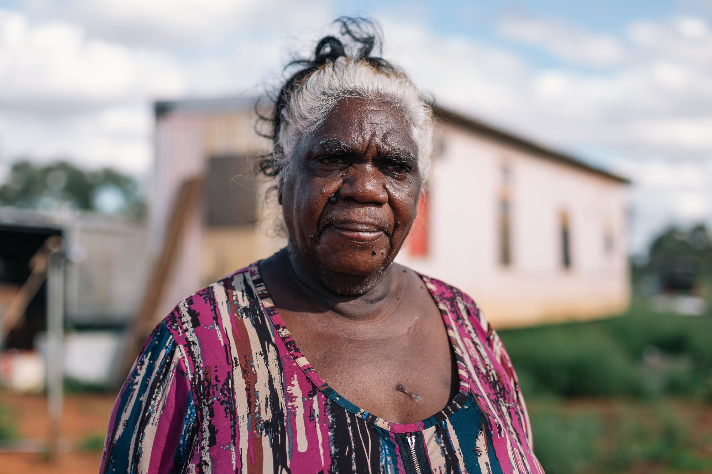

# Dianne, Tennant Creek

"It means something that really makes me happy. Every time I go away, it's like it's calling me. Come back home."

Dianne Stokes is a Warumungu and Warlmanpa Elder. She designed and named both Goods products, and this is her talking about Pakkimjalki Kari, the washing machine that carries the name she gave it. The products did not arrive in Tennant Creek. They started there.

Dianne Stokes, Tennant Creek, 2026.

## Flagged for Ben
none
