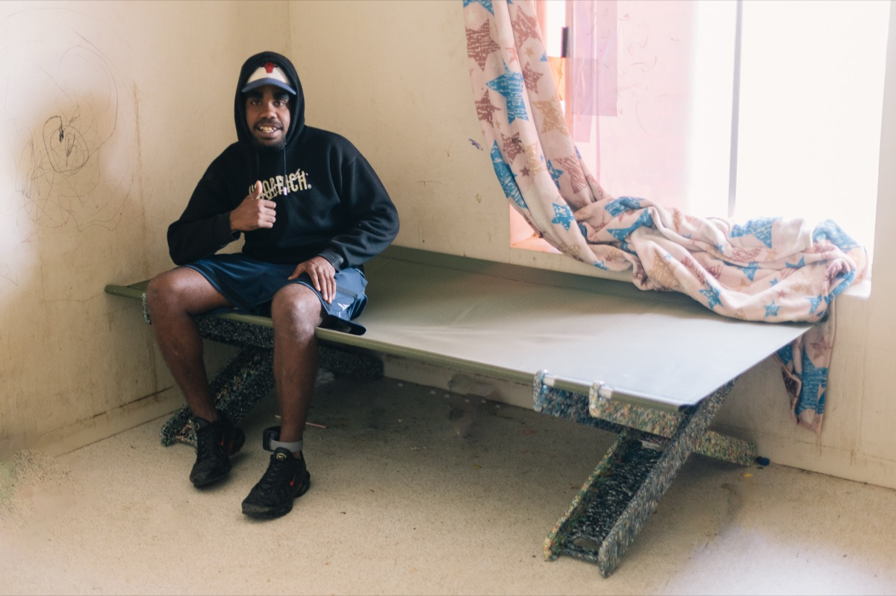

# Mykel, Alice Springs

"Yeah, I'll be rocking up every day to make them."

Two days behind the Oonchiumpa office in May, young men and young women built Stretch Beds from flat-pack components. Mykel built this one, and it went home with him, because every young person who built a bed kept one. That sentence is him answering what he'd do if the making stayed local.

Mykel, Alice Springs, May 2026.

## Flagged for Ben
none. Youth-care framing rule applies: Mykel is presented through the Oonchiumpa program context, per the registry note.
