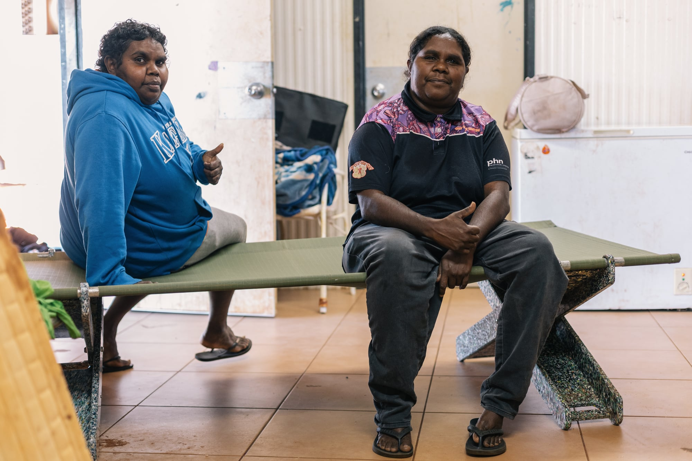

# Voice: Dorrie Jones, Arlparra

*Pictured: two women testing a Stretch Bed in a Utopia Homelands home, May 2026.*

"Good for me and comfy, easy to put together."

The May delivery went family by family across the homelands, with local teams naming the households and setting the beds up. What comes next at Urapuntja is not decided by Goods. Jane Wilson has opened a conversation about young people and one machine, and the community will choose.

Voice: Dorrie Jones, Arlparra, Utopia Homelands, May 2026.

## Flagged for Ben
No verified portrait of Dorrie exists in the repo. Shoot-list gap: a portrait of Dorrie, with her consent, next Utopia visit.
