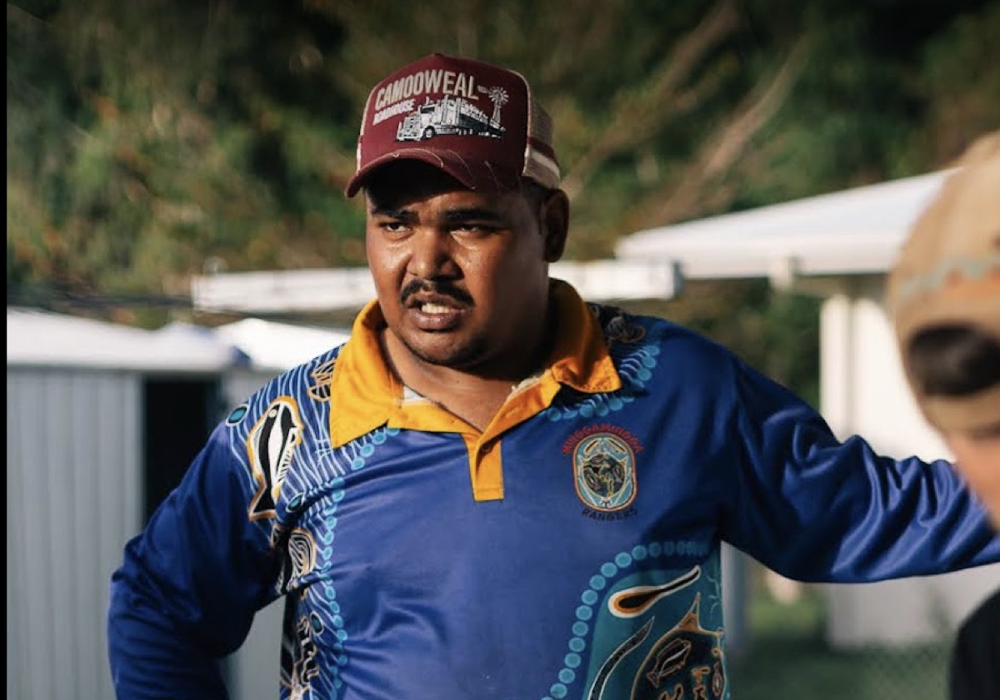

# Jahvan, Palm Island

"There's gotta be a break in the cycle somewhere. Soon as you break the cycle, all this stuff stop. People stopped going to jail. People stopped fighting amongst each other."

Jahvan said this during a washing machine delivery on Palm Island, to his Nan's older sister's household. He is a Goods team member, training with Defy Design, and the plan he talks about is running production himself. The break in the cycle has a face and a trade.

Jahvan Oui, Palm Island, July 2026.

## Flagged for Ben
The portrait file currently exists only on the `feat/six-front-doors` worktree branch (commit 12bf5b9); it reaches the main tree when that branch merges. The people in the delivery footage around Jahvan (the household receiving the machine) are not cleared and do not appear here.
